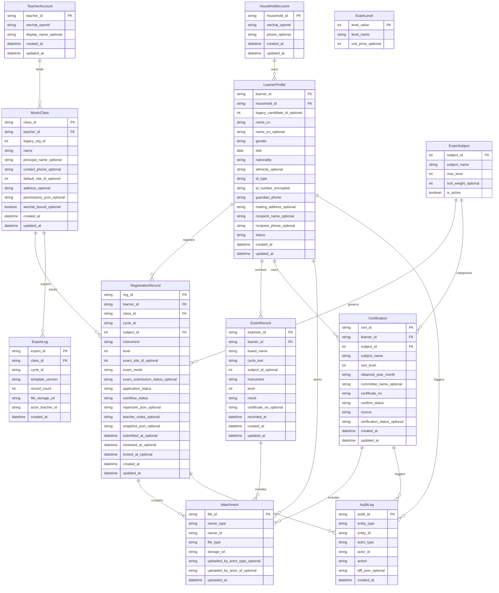

Understood. Below is the **updated canonical ERD Mermaid** reflecting Task #2 v2.0, including the critical refactor:

* `RegistrationRecord.workflow_status` vs `RegistrationRecord.application_status`
* `MusicClass.legacy_org_id` as the export anchor for “报名机构ID”
* Attachments linked to **LearnerProfile / RegistrationRecord / ExamRecord / Certification**
* Optional `ExportLog` entity (recommended MVP)
* I keep your comment/section conventions and naming stability.

---

## Canonical ERD (v2.0)

---

# Refactoring notes (what I expect you mean by “entity relationship refactor”)

Based on your latest constraints and the source files, there are two likely refactors worth doing now (before dev):

## Refactor A — Replace/avoid ClassEnrollment

Earlier we discussed `ClassEnrollment` and join codes, but your data reality says:

* `机构` maps directly to the teacher profile (`MusicClass`)
* Students don’t necessarily “enroll” via join code; teacher can view the students whose RegistrationRecord references their MusicClass

**Recommendation (MVP):** drop `ClassEnrollment` entirely.

* Teacher roster is driven by `RegistrationRecord.class_id`
* This matches your imported files and simplifies authorization.

If later you want stronger “teacher-student binding” outside registration, we can reintroduce enrollment as an optional layer.

## Refactor B — RegistrationRecord vs LearnerProfile “template fields”

Because export requires many learner fields, we should ensure **Lock writes snapshot_json** and export uses snapshot, not live profile.

We already reflected that. The operational question is:

* Do we ever need **multiple phone numbers** or **multiple ID documents** per learner?
  If yes, consider splitting “IdentityDocument” into its own table later. For MVP, keep it on LearnerProfile.

---

If you confirm Refactor A (dropping ClassEnrollment), I will update the earlier docs/diagrams to remove it and tighten the authorization model (“teacher can only see registrations under their MusicClass”).
