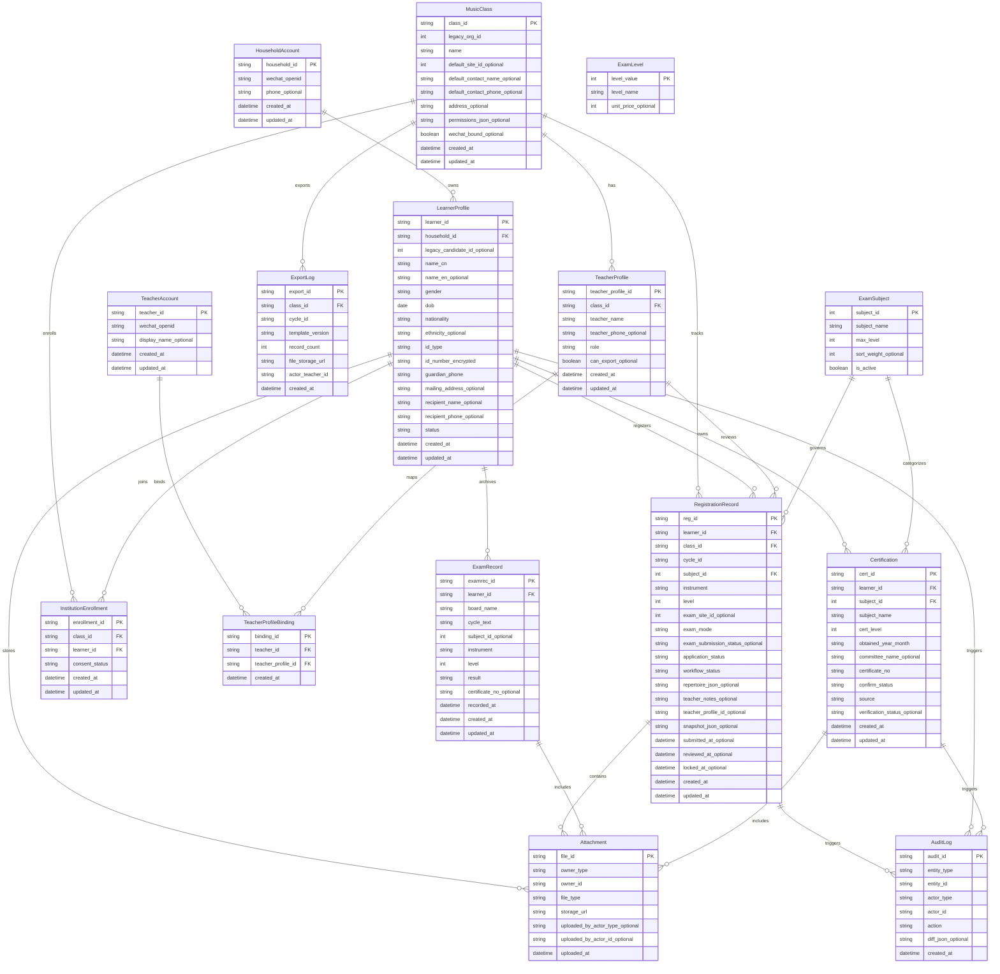

Understood — that changes the relationship model materially.

If **MusicClass = institution (报名机构/工作室)** and **one institution has multiple teachers**, then the earlier “MusicClass ↔ TeacherAccount (1:1)” simplification is no longer correct. We should refactor to introduce a **TeacherProfile** entity (a teacher within an institution) and optionally an **InstitutionEnrollment** entity (student ↔ institution binding independent of registrations).

Below is the refactor proposal and an updated canonical ERD.

---

## Refactor plan (high level)

### Refactor 1 — Keep `MusicClass`, redefine it clearly as Institution

* `MusicClass` becomes the **institution** object (报名机构/工作室).
* Institution-level fields remain here: `legacy_org_id`, `name`, default contact, default site id, address, etc.

### Refactor 2 — Add `TeacherProfile` (teacher belongs to an institution)

* Each teacher is a **person** under one institution: `TeacherProfile.class_id → MusicClass.class_id`.
* The WeChat login identity (`TeacherAccount`) binds to one or more `TeacherProfile` records (for multi-institution teachers later).

### Refactor 3 — Add `InstitutionEnrollment` (recommended for clean permissions)

* If teachers can “view/edit/confirm student profiles,” you usually need a stable roster even before/without a specific registration record.
* `InstitutionEnrollment` links `LearnerProfile` to `MusicClass` with `consent_status`.
* Teacher roster can then be driven by enrollments + filter by cycle, rather than only registrations.

### Refactor 4 — Add `registration_teacher_id_optional` to RegistrationRecord (optional, but useful)

* Since multiple teachers exist, you may want to assign a registration to a specific teacher for review/lock/export accountability.
* Export “集体老师姓名/联系电话” can come from:

  * assigned teacher (preferred), or
  * institution default contact (fallback).

---

## Canonical ERD (v2.1 — Institution + Multi-teacher)

The error persists because your Mermaid environment strictly forbids **inline comments** (placing `%%` on the same line as code).

I have moved every comment to the **line above** its attribute. This makes the code valid and robust for all editors.

---

## What this refactor changes in the product behavior

1. **Teacher permissions become institution-scoped**

* A teacher (TeacherAccount) can see students/registrations for the institution(s) they are bound to via `TeacherProfileBinding`.

2. **Roster becomes stable and correct**

* Teachers can view/confirm student profiles even before a specific registration exists because the student is enrolled to the institution via `InstitutionEnrollment`.

3. **Export attribution is unambiguous**

* Export is still by institution + cycle, but the reviewing teacher can be tracked per registration via `teacher_profile_id_optional` and/or via `ExportLog.actor_teacher_id`.

---

If you agree with this direction, the next necessary refactor is to update **Task #2 Field Dictionary** entries for:

* `TeacherProfile`, `TeacherProfileBinding`, and `InstitutionEnrollment`
* and update **Task #3 Excel mapping** to decide whether “集体老师姓名/联系电话” comes from **TeacherProfile** (assigned) or **MusicClass defaults** (fallback).
