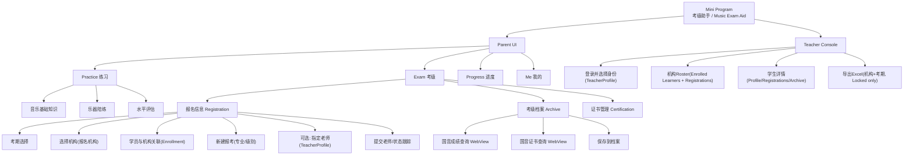

# 3) Updated Information Architecture (IA v2.1)

```mermaid
flowchart TB
  A["Mini Program<br/>考级助手 / Music Exam Aid"] --> P["Parent UI"]
  A --> T["Teacher Console"]

  %% Parent tabs
  P --> B["Practice 练习"]
  P --> C["Exam 考级"]
  P --> D["Progress 进度"]
  P --> E["Me 我的"]

  %% Practice
  B --> B1["音乐基础知识"]
  B --> B2["乐器陪练"]
  B --> B3["水平评估"]

  %% Exam
  C --> C1["报名信息 Registration"]
  C --> C2["考级档案 Archive"]
  C --> C3["证书管理 Certification"]

  %% Registration
  C1 --> R1["考期选择"]
  C1 --> R2["选择机构(报名机构)"]
  C1 --> R3["学员与机构关联(Enrollment)"]
  C1 --> R4["新建报考(专业/级别)"]
  C1 --> R5["可选: 指定老师(TeacherProfile)"]
  C1 --> R6["提交老师/状态跟踪"]

  %% Archive
  C2 --> A1["国音成绩查询 WebView"]
  C2 --> A2["国音证书查询 WebView"]
  C2 --> A3["保存到档案"]

  %% Teacher console
  T --> T0["登录并选择身份(TeacherProfile)"]
  T --> T1["机构Roster(Enrolled Learners + Registrations)"]
  T --> T2["学生详情(Profile/Registrations/Archive)"]
  T --> T3["导出Excel(机构+考期, Locked only)"]
```
