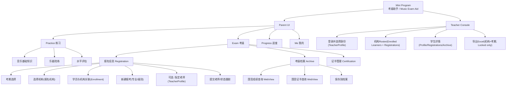

Understood. Below is the **full v2.1 refactor update** across the design pack, so every prior artifact (scope, personas, IA, journeys, permissions, screens, and data dictionary assumptions) is consistent with the **ERD v2.1** where:

* **MusicClass = Institution (报名机构/工作室)**
* **Institution has multiple teachers (TeacherProfile)**
* **Teachers log in via TeacherAccount and bind to TeacherProfiles**
* **Students belong to institutions via InstitutionEnrollment (consent-based)**
* **RegistrationRecord can optionally be assigned to a specific teacher_profile_id**

---

# 1) Updated Product Scope Statement (MVP v2.1)

**Product:** WeChat Mini Program “考级助手 / Music Exam Aid”

**MVP Objective:**
Enable parents to (a) create/manage learner profiles, (b) link learners to an **institution (MusicClass)** with consent, (c) create exam-cycle registrations (per subject/level), optionally assign to a specific teacher, (d) submit for teacher review → confirm/lock, and (e) export an upload-ready Excel template (v2.1) at the **institution + cycle** level. Additionally, provide a “考级档案” vault for saving 国音 exam results/certificates (manual assisted via WebView).

**Non-goals (MVP):** WeChat Pay, automated scraping/auto-sync from 国音, full LMS, end-to-end official submission.

---

# 2) Updated Personas (MVP v2.1)

## Parent (WeChat account owner)

* Create/manage learners
* Request/join **institution membership** (enrollment consent)
* Create registrations per cycle (per subject/level)
* Submit to teacher review
* Maintain archive/certifications

## Student (practice actor)

* Uses parent device; uses Practice features

## Teacher (institution staff)

Two layers:

* **TeacherAccount (WeChat identity)**: login container
* **TeacherProfile (within an institution)**: determines permissions and roster scope
  Responsibilities:
* View institution roster (enrolled learners)
* Review/edit/confirm/lock registrations
* Export Excel for institution + cycle
* View archive/certifications for eligibility checks

---

# 3) Updated Information Architecture (IA v2.1)

---

# 4) Updated Core User Journeys (v2.1)

## 4.1 Parent: enrollment → registration → teacher review

## 4.2 Teacher: institution export (cycle + Locked only)

---

# 5) Updated Permission Matrix (MVP v2.1)

| Object / Action                                     | Parent | Student          | TeacherProfile                             |
| --------------------------------------------------- | ------ | ---------------- | ------------------------------------------ |
| LearnerProfile view                                 | Yes    | Yes (via parent) | Yes (enrolled learners only)               |
| LearnerProfile edit                                 | Yes    | No               | Limited (format corrections; logged)       |
| InstitutionEnrollment create/consent                | Yes    | No               | View (for institution)                     |
| RegistrationRecord create/edit (Draft/NeedsChanges) | Yes    | No               | Yes (institution scope)                    |
| Registration submit                                 | Yes    | No               | No                                         |
| Request changes                                     | No     | No               | Yes                                        |
| Confirm                                             | No     | No               | Yes                                        |
| Lock / Unlock (restricted)                          | No     | No               | Yes (role-based)                           |
| Export Excel                                        | No     | No               | Yes (role-based; typically Admin/Exporter) |
| ExamRecord / Archive view                           | Yes    | No               | Yes (enrolled learners)                    |
| Certification create/edit                           | Yes    | No               | Yes (confirm only or edit if allowed)      |
| Reveal full ID                                      | No     | No               | Yes (permissioned + AuditLog)              |

---

# 6) Updated Screen Design Notes (key deltas)

## Parent-side deltas

1. **Institution selection becomes first-class** in Exam → Registration flow.
2. Add an **Enrollment step** (lightweight) before allowing teacher-side visibility:

   * Parent selects institution → system creates `InstitutionEnrollment`.
   * For MVP, you can default `consent_status=Granted` if the selection itself implies consent.
3. **Optional teacher assignment** on registration:

   * Field: `指定老师（可选）` from `TeacherProfile` list under the selected institution.
   * Stored as `RegistrationRecord.teacher_profile_id_optional`.

## Teacher-side deltas

1. Teacher login selects **TeacherProfile identity**, not institution directly:

   * TeacherAccount may map to multiple TeacherProfiles (future-proof).
2. Roster can be driven by:

   * **InstitutionEnrollment** (stable learner roster), with registration counts per cycle, and/or
   * RegistrationRecord list (actionable tasks).
     MVP approach: keep your current RegistrationRecord roster, but permissions should reference that the learner is enrolled or registration.class_id matches teacher’s institution.

---

# 7) Task #2 Field Dictionary Updates (v2.1 delta)

## Modified: MusicClass (institution)

* Remove assumption: `teacher_id FK` direct binding (institution can have many teachers).
* Keep: `legacy_org_id`, `name`, defaults, address, permissions.

## New: TeacherProfile

* `teacher_profile_id PK`
* `class_id FK` (institution)
* `teacher_name`, `teacher_phone_optional`
* `role` (Admin/Reviewer/Assistant)
* `can_export_optional` (or role-based)

## New: TeacherProfileBinding

* `binding_id PK`
* `teacher_id FK` (TeacherAccount)
* `teacher_profile_id FK`
* Supports one WeChat identity mapped to multiple institutions/roles.

## New: InstitutionEnrollment

* `enrollment_id PK`
* `class_id FK` (institution)
* `learner_id FK`
* `consent_status` (Pending/Granted/Revoked)
* Enables stable teacher access to learner profile/archive.

## Modified: RegistrationRecord

* Add `teacher_profile_id_optional` for assignment and export attribution
* Keep `workflow_status` vs `application_status` split

---

# 8) Canonical ERD (v2.1) Reference

We will use the **ERD v2.1** you approved (Institution + TeacherProfile + Enrollment + Binding). That ERD is now the single source of truth for all subsequent documents.

---

# 9) Refactoring checklist (what we are “changing” from v2.0)

1. `TeacherAccount -> MusicClass` direct bind is replaced by:

   * `TeacherAccount -> TeacherProfileBinding -> TeacherProfile -> MusicClass`
2. Teacher scope becomes:

   * “teacher can operate within institutions they have a TeacherProfile for”
3. Add roster correctness:

   * `InstitutionEnrollment` becomes the stable student↔institution relationship
4. Registration assignment becomes optional:

   * `RegistrationRecord.teacher_profile_id_optional`

---

If you want to proceed next, the most important follow-on is to update **Task #3 Excel mapping** to specify the precedence for “集体老师姓名/联系电话”:

1. If `teacher_profile_id_optional` exists → use TeacherProfile name/phone
2. Else → fallback to MusicClass default contact fields (or blank)

I can produce that mapping update immediately in the next response.
