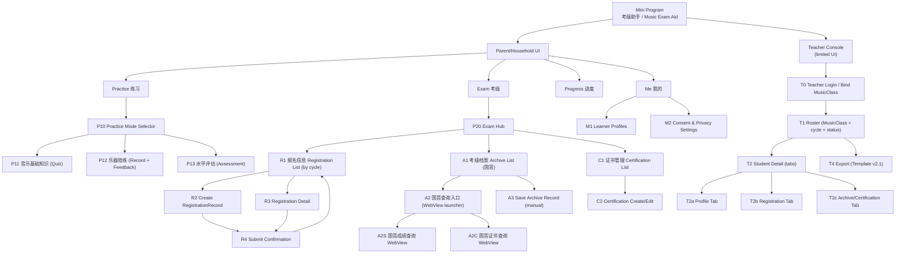
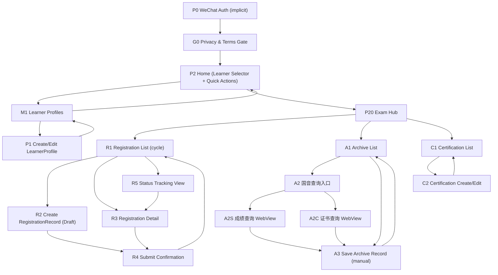
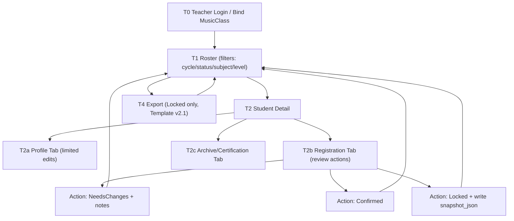
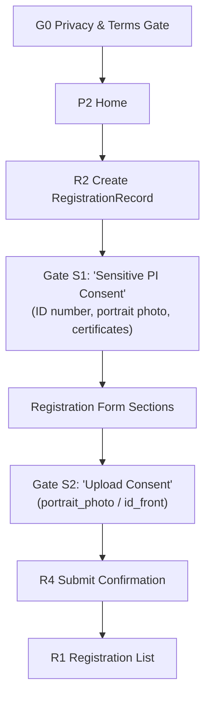
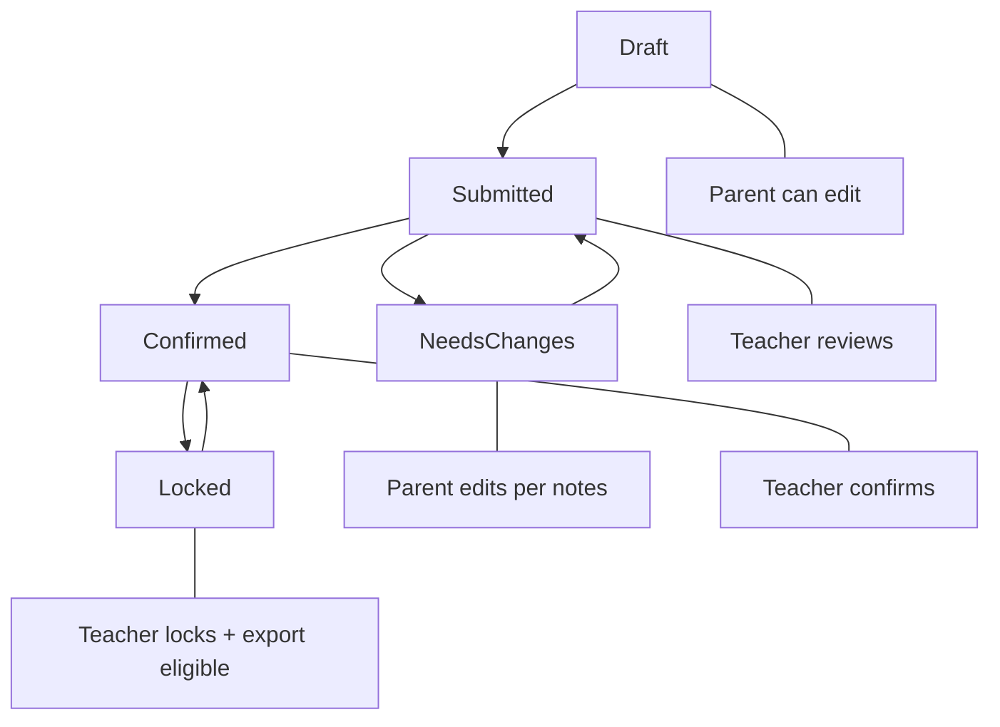

Understood. Below are the **Mermaid diagrams** that convert Task #1 into a high-level **screen IA + screen flow**, consistent with your conventions (clear sectioning, stable naming, and quoted labels where appropriate).

---

# Diagrams — Screen IA + Screen Flow (MVP v1.1)

## A) Screen IA Map (Parent + Teacher)

---

## B) Parent Core Screen Flow (Registration + Archive + Certification)

---

## C) Teacher Core Screen Flow (Review → Confirm/Lock → Export)

---

## D) Consent Micro-Gates (Sensitive Data Progressive Collection)

---

## E) Registration State + Screen Ownership Map

---

If you confirm the **single “default template v2.1”** as the MVP export template (no regional variants for now), I will proceed next with a tightened **screen-by-screen field list** (exact form fields per screen, with required/optional flags derived from the export template) so development can start with minimal ambiguity.
