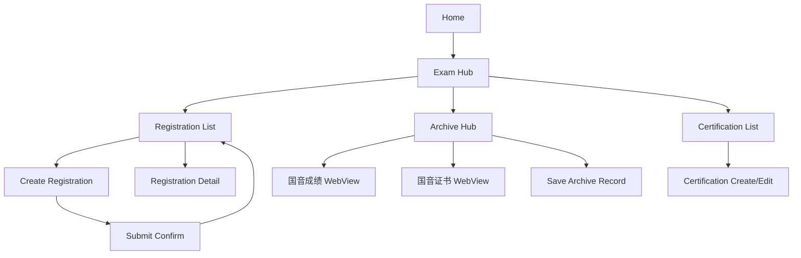

Below is **Task #1: Screen inventory + wireframe notes** (MVP v1.1), aligned to your current HLD, data model, and Mermaid conventions. I’m keeping it implementation-oriented: each screen lists **purpose, key fields, CTAs, states, and status transitions**.

---

# Task #1 — Screen Inventory + Wireframe Notes (MVP v1.1)

## A) Parent / Household (Mini Program)

### P0. WeChat Auth Gate (implicit)

* **Purpose:** obtain OpenID and create/lookup `HouseholdAccount`
* **CTA:** none (auto)
* **States:**

  * First-time: create account → go to P1
  * Returning: go to P2 (last used learner)

---

### P1. Onboarding: Create LearnerProfile

* **Purpose:** create first child profile quickly
* **Fields (LearnerProfile):**

  * 姓名（中文）`name_cn` (required)
  * 拼音/英文 `name_en_optional` (optional)
  * 性别 `gender` (required)
  * 出生日期 `dob` (required; accept YYYYMMDD input)
  * 国籍 `nationality` (default 中国; required)
  * 民族 `ethnicity` (optional)
  * 证件类型 `id_type` (required)
  * 证件号码 `id_number` (required; masked display)
  * 联系电话 `guardian_phone` (required)
* **Attachments (required gating later):**

  * 彩照 `portrait_photo` (optional at onboarding, required before submit if template requires)
  * 证照正面 `id_front` (optional unless template/teacher requires)
* **CTAs:**

  * 保存并继续 → P2
  * 暂不上传照片 → P2
* **Empty/Error states:**

  * Missing required fields → inline error
  * Invalid date/phone format → inline error

---

### P2. Home (Profile Selector + Quick Actions)

* **Purpose:** central hub; select learner and jump to practice/exam
* **Components:**

  * Learner selector (if >1 child; otherwise hidden)
  * Cards:

    * 练习（Practice）→ P10
    * 考级（Exam）→ P20
    * 进度（Progress）→ P30
* **CTAs:**

  * 切换学生
  * 新增学生 → P1
* **States:**

  * No learner → redirect P1

---

## Practice module

### P10. Practice Mode Selector

* **Purpose:** entry to 3 modes
* **Options:**

  * 音乐基础知识 → P11
  * 乐器陪练 → P12
  * 水平评估 → P13
* **CTAs:** start chosen mode

#### P11. 音乐基础知识（Quiz）

* **MVP note:** can be stubbed with “题包选择 + 做题 + 错题本” (does not affect registration/export)

#### P12. 乐器陪练（Record + Feedback）

* **MVP note:** does not affect export; keep separate storage (practice session table later)

#### P13. 水平评估（Assessment）

* **MVP note:** provides readiness label only; not required for registration MVP

---

## Exam module (核心)

### P20. Exam Hub（考级）

* **Purpose:** entry to registration + archive
* **Cards:**

  * 报名信息 → P21
  * 考级档案（国音）→ P25
  * 证书管理 → P28
* **CTAs:** enter each

---

### P21. Registration List (by cycle)

* **Purpose:** view and manage `RegistrationRecord` for current learner
* **Filters:**

  * 考期 `cycle_id` (default current)
  * 状态 `status` (Draft/Submitted/NeedsChanges/Confirmed/Locked)
* **List row shows:**

  * 专业 `instrument`
  * 级别 `level`
  * 机构 `MusicClass.name`
  * 状态 badge
  * 缺失提示（例如：缺彩照/缺证件号/级别不合法等）
* **CTAs:**

  * 新建报考 → P22
  * 打开某条记录 → P23
* **Empty states:**

  * 无报名记录：提示新建

---

### P22. Create RegistrationRecord（新建报考）

* **Purpose:** create one subject application for a cycle
* **Fields (RegistrationRecord):**

  * 考期 `cycle_id` (required)
  * 机构 `MusicClass` (required; choose from list / search)
  * 专业 `subject_id` / `instrument` (required; dropdown from ExamSubject)
  * 级别 `level` (required; **filtered to 1..max_level**)
  * 考试方式 `exam_mode` (required)

    * rule: if 专业=音乐基础知识 → exam_mode forced “音基”
  * 报考状态 `status` (default 未申请 / 审核中 / 审核通过 per ops preference)
  * 考试曲目（1–4）`repertoire` (optional; structured inputs)
* **CTAs:**

  * 保存为草稿 → P21
  * 保存并提交老师 → P24 (sets status=Submitted)
* **Validation:**

  * level within max_level (hard)
  * required fields present

---

### P23. RegistrationRecord Detail（报名详情）

* **Purpose:** edit/view one registration record
* **Header:** 专业 + 级别 + 状态
* **Sections:**

  1. 学生信息快照（read-only preview; pulls from LearnerProfile）

     * 姓名、性别、出生日期、证件类型（证件号默认脱敏）、联系电话
     * 彩照/证照正面：显示上传状态
  2. 报考信息（editable in Draft/NeedsChanges）

     * 机构、专业、级别、考试方式、曲目1–4
  3. 老师反馈（if NeedsChanges）

     * teacher_notes
* **CTAs:**

  * 编辑/保存（if Draft/NeedsChanges)
  * 提交老师（if Draft/NeedsChanges) → status=Submitted
  * 撤回提交（optional MVP; else omit)
* **Locked state:**

  * All fields read-only; show “已锁定，仅老师可解锁”

---

### P24. Submit Confirmation (提交给老师)

* **Purpose:** user confirmation before status change
* **Displays:**

  * checklist: required fields + required attachments status
* **CTAs:**

  * 确认提交 → set status=Submitted
  * 返回修改

---

### P25. Archive Hub（考级档案 - 国音）

* **Purpose:** assisted query + save exam record
* **Actions:**

  * 成绩查询（WebView）→ P26
  * 证书查询（WebView）→ P27
  * 档案列表 → P25a
* **CTAs:** open

#### P26. WebView: 国音成绩查询

* **Purpose:** open official page in WebView
* **CTA:** 返回并归档 → P25b (manual save form)

#### P27. WebView: 国音证书查询

* **Purpose:** open official page in WebView
* **CTA:** 返回并归档 → P25b

#### P25a. Archive List（档案列表）

* **List row:** board, 专业/级别, 日期/考期, 结果, 附件数
* **CTA:** 查看详情 → P25c; 新增归档 → P25b

#### P25b. Save Archive Record（保存到档案）

* **Purpose:** store structured `ExamRecord` (and optionally link to Certification later)
* **Fields:**

  * 考级机构（默认 国音）
  * 考期/日期（手输或选择）
  * 专业、级别
  * 成绩（合格/不合格/无成绩）
  * 证书编号（可选）
  * 上传附件：截图/电子证书
* **CTAs:** 保存

#### P25c. Archive Detail

* **Purpose:** view stored archive + attachments
* **CTAs:** 编辑（optional MVP), 删除（optional)

---

### P28. Certification List（证书管理）

* **Purpose:** manage `Certification` entity
* **List row:** 专业、级别、获得年月、证书编号、确认状态
* **CTAs:**

  * 新增证书 → P29
  * 查看/编辑 → P29 (edit mode)

### P29. Certification Create/Edit

* **Fields (Certification):**

  * 专业名称（dropdown）
  * 几级证书（1–11）
  * 获得年月（YYYY-MM）
  * 考级委员会名称（optional）
  * 证书编号（required）
  * 上传证书照片（Attachment: certificate_photo）
* **CTAs:**

  * 保存
  * 删除（edit only; optional)

---

## Progress module (MVP-light)

### P30. Progress Overview

* **Purpose:** show high-level activity; can be placeholder in MVP
* **CTAs:** none

---

## Me module (MVP-light)

### P40. Settings / Support

* **Purpose:** help, privacy notice, data deletion request entry
* **CTAs:** manage learners → P1/P2

---

# B) Teacher Console (limited UI)

### T0. Teacher Auth Gate

* **Purpose:** login and bind teacher identity to one or more `MusicClass`
* **MVP approach:** teacher selects a `MusicClass` (机构) from allowed list (admin-seeded)
* **CTA:** 进入老师端

---

### T1. Roster (by MusicClass + cycle)

* **Purpose:** manage registrations workflow
* **Filters:**

  * 机构（MusicClass）
  * 考期（cycle_id）
  * 状态（Submitted/NeedsChanges/Confirmed/Locked）
  * 专业、级别
* **List row shows:**

  * 学生姓名
  * 专业/级别
  * 状态 badge
  * 缺失项 badges（缺彩照/缺证件号/级别越界等）
* **CTAs:**

  * 打开学生详情 → T2
  * 批量导出（shortcut) → T4

---

### T2. Student Detail (tabs)

Tabs:

1. **Profile（学生档案）**
2. **Registration（报名记录）**
3. **Archive（档案/证书）**

#### T2a. Profile tab

* **Purpose:** view + limited corrections of LearnerProfile
* **Fields:** same as LearnerProfile + attachment status
* **Edit rules:**

  * allow formatting corrections (name/pinyin), phone fix
  * ID reveal action requires logging
* **CTAs:** 保存修改; 请求家长补充彩照/证件照（sets NeedsChanges reason template)

#### T2b. Registration tab

* **Purpose:** review/confirm/lock per RegistrationRecord
* **Components:**

  * list of registrations for this learner & cycle
  * each record has detail panel (专业/级别/曲目/考试方式)
  * teacher_notes input
* **CTAs per record:**

  * 退回修改 → status=NeedsChanges + notes
  * 确认 → status=Confirmed
  * 锁定 → status=Locked + write snapshot_json
  * 解锁（restricted）→ Locked→Confirmed

#### T2c. Archive tab

* **Purpose:** view saved 国音档案 + Certification list
* **CTAs:** Teacher confirm on Certification (sets `confirm_status=TeacherConfirmed`)

---

### T4. Export (Excel template v2.1)

* **Purpose:** export only Locked registrations for a given MusicClass + cycle
* **Inputs:**

  * 机构（MusicClass）
  * 考期（cycle）
  * 模板（v2.1）
* **Output:**

  * downloadable `.xlsx`
  * export summary (count, time, operator)
* **CTAs:**

  * 生成导出文件
  * 下载
* **Error states:**

  * 0 locked records
  * snapshot missing (should not happen if lock gate correct)

---

# C) Admin-lite (optional; if you need seed data)

### A1. Dictionary Import (ExamSubject/ExamLevel/MusicClass)

* **Purpose:** load your Excel lists into system
* **MVP note:** can be done as backend script; UI optional

---

## D) Screen-flow diagram (Parent core)

---

## E) Critical state transitions (where buttons change status)

* Parent “提交老师” (P22/P23 → P24) sets **Submitted**
* Teacher “退回修改” sets **NeedsChanges**
* Teacher “确认” sets **Confirmed**
* Teacher “锁定” sets **Locked + snapshot_json written**
* Teacher export pulls **Locked only**

---

If you want, next I will convert the above into a **single consolidated “Screen Spec” doc** with numbered components per screen (e.g., P22-1 Header, P22-2 Form, P22-3 Validation banner), which your dev can implement almost directly.

### Next actions (the list we agreed)

1. **Screen inventory + wireframe notes** (every screen, fields, CTAs, empty states)
2. **Field dictionary** (exact labels, types, validation, required-by-template flags)
3. **Excel template mapping doc** (column-by-column mapping + formatting rules)
4. **Event tracking plan** (activation/retention funnel, teacher confirmation/export funnel)

You asked to start with **(1)**, but first I’ll address your onboarding question because it directly changes the screen design.

---

## Onboarding + sensitive data: do we need to follow 等保 rules?

In practice, yes—you should **design as if MLPS/等保 applies** and run a formal **定级** early, because you will store **minors’ personal information** and **ID-related fields** for exam registration.

* **PIPL baseline (个人信息保护法):**

  * Data minimization and purpose limitation are explicit obligations (e.g., “限于最小范围，不得过度收集”). ([spp.gov.cn][1])
  * **Biometrics** and **personal info of minors under 14** are **敏感个人信息**. ([spp.gov.cn][1])
  * Processing sensitive PI requires **单独同意**, plus extra notice of necessity/impact. ([spp.gov.cn][1])
  * For **under 14**, you must obtain **guardian consent** and have **special processing rules**. ([spp.gov.cn][1])
  * You should do a **PI protection impact assessment** before processing sensitive PI and keep records (≥3 years). ([spp.gov.cn][1])

* **等保/MLPS (等级保护):**

  * The “定级指南” is GB/T 22240-2020. ([openstd.samr.gov.cn][2])
  * For **Level 2+ systems**, filing/备案 is generally required after level determination (the管理办法 describes “第二级以上…办理备案手续” and timing requirements). ([sz.gov.cn][3])
  * Exact level (1/2/3) depends on your impact assessment; given minors + identity data, you should assume **at least Level 2 controls** in MVP design and verify via formal 定级.

* **WeChat Mini Program platform compliance:** if you process personal information, WeChat requires completing the **“用户隐私保护指引”** and related consent gating for privacy-related capabilities. ([cloud.tencent.com][4])

### Design implication for MVP onboarding

**Do not collect sensitive fields at first launch.** Collect them **only at the moment they become necessary** (e.g., when creating a RegistrationRecord for a specific exam cycle), and gate them behind:

* Clear purpose notice + retention period
* **Separate consent** for sensitive fields (ID number, face photo/彩照, certificates upload, etc.)
* Guardian confirmation for under-14 (in product terms: parent is the WeChat account owner, so consent is naturally anchored, but you should still present it explicitly)

---

# (1) Screen inventory + wireframe notes (MVP)

Below is an implementation-oriented screen list. I’ve kept it “wireframe-notes style”: **Fields**, **CTAs**, **Empty states**, **Rules/validations**, **Privacy notes**.

## Global

### G0. First launch gate (Privacy + Terms)

* **Purpose:** platform + legal readiness before any PI processing
* **UI:** short summary + links to full “隐私政策 / 用户协议”
* **CTAs:** `同意并继续` / `不同意退出`
* **Rules:** block login/session initialization that would store PI until accepted
* **Privacy note:** PIPL “告知—同意” baseline; record consent timestamp/version. ([spp.gov.cn][1])

### G1. Role context (implicit)

* No explicit “persona switch.” Parent/Student share one account.
* Teacher is a separate login path (via WeChat openid mapping to TeacherAccount).

---

## Tab: 我的 Me

### M1. Me home

* **Content:** account status, linked classes, learner count
* **CTAs:** `新增学员` `加入班级` `隐私与授权管理` `数据导出申请（后续）`
* **Empty state:** “还没有学员档案，先创建一个”

### M2. Consent & data controls (MVP-light, but important)

* **Sections:**

  * Consent records (privacy policy version, timestamps)
  * Toggle: “允许上传彩照/证书附件”（can be default OFF until needed）
  * `注销/删除账号` (optional MVP, but at least “申请删除”)
* **Privacy note:** withdrawal must be possible and not block essential service unless necessary. ([spp.gov.cn][1])

---

## Tab: 考级 Exam

### E1. Exam home (2 cards)

* **Cards:** `报名信息` / `考级档案`
* **Badges:** pending submissions, teacher feedback count

---

## Exam → 报名信息 Registration

### R1. Cycle selector (考期选择)

* **Fields:** Year, cycle (上半年/下半年), board/region template (MVP: 1–2 templates)
* **CTAs:** `创建报名` `查看历史报名`
* **Rules:** cycle drives allowed 专业/级别 lists (from 简章 rules screenshot; we’ll formalize later)

### R2. Learner picker

* **List:** learners under HouseholdAccount
* **CTAs:** `选择学员` `新增学员`
* **Empty state:** “先创建学员档案才能报名”

### R3. Registration form (Draft)

* **Sections (wireframe):**

  1. **Basic:** 专业(乐器/方向), 级别, 报考曲目(如需要), 考点(可选), 指导老师/机构(默认绑定teacher)
  2. **Identity (only if template requires):** 姓名、证件类型、证件号、出生日期等
  3. **Attachments:** 彩照（上传）、其他材料（如需要）
* **CTAs:** `保存草稿` `提交老师审核`
* **Validations:**

  * Required fields depend on template mapping (to be defined in task 3)
  * ID number format validation (type-based)
  * 彩照 file type/size limits; strip EXIF metadata (recommended)
* **Empty state:** show template-specific “还缺 X 项必填”
* **Privacy notes (critical):**

  * Under PIPL, **biometrics** and **under-14 PI** are sensitive; face photo/彩照 should be treated as sensitive PI. ([spp.gov.cn][1])
  * For sensitive PI you should do PIPIA and keep records. ([spp.gov.cn][1])
  * UI should present **单独同意** when user first enters “证件号/彩照上传” section. ([spp.gov.cn][1])

### R4. Submit confirmation (status becomes Submitted)

* **Content:** summary of key fields + “teacher will review”
* **CTAs:** `确认提交` `返回修改`
* **Rules:** once submitted, editing is blocked except fields teacher flags (or you allow full edit in NeedsChanges state)

### R5. Registration status tracking

* **Timeline:** Draft → Submitted → NeedsChanges → Confirmed → Locked
* **CTAs:**

  * If NeedsChanges: `按老师意见修改`
  * If Locked: `查看导出状态（只读）`
* **Empty state:** no registrations yet

---

## Exam → 考级档案 Archive (国音 results/certificates vault)

### A1. Archive list

* **List items:** board, cycle_text, instrument, level, result, cert no (optional), verification status (manual)
* **CTAs:** `新增档案记录` `去国音查询` (WebView entry points)
* **Empty state:** “还没有档案记录，建议先从国音查询后归档”

### A2. 国音查询 WebView launcher

* **Buttons:** `成绩查询` `证书查询`
* **UI note:** clearly indicate “官方页面在 WebView 打开，本小程序不自动抓取”
* **Privacy note:** Non-goal is automated scraping; keep it manual.

### A3. Save to archive (manual capture form)

* **Fields:** cycle/date, instrument, level, result, certificate_no, optional screenshot/e-certificate upload
* **CTAs:** `保存` `取消`
* **Validations:** required minimal set; attachments optional
* **Privacy note:** certificate screenshots can contain ID info → treat as sensitive PI.

---

## Tab: 练习 Practice

### P1. Practice home (3 entry cards)

* **Cards:** `音乐基础知识` `乐器陪练` `水平评估`
* **CTAs:** `开始练习` `继续上次`

### P2. 音乐基础知识 (Quiz pack list)

* **List:** packs by level/instrument
* **CTAs:** `开始` `错题本`
* **Empty state:** “暂无题包（配置中）”

### P3. Quiz session

* **UI:** single question, answer options, explanation after submit
* **CTAs:** `提交` `下一题` `加入错题本`
* **Rules:** capture wrong answers for 错题本

### P4. 错题本

* **List:** wrong questions by tag
* **CTAs:** `再练一次` `移除`
* **Empty state:** “错题本是空的，继续保持”

### P5. 乐器陪练 (record landing)

* **Fields:** choose learner, instrument (default), target exercise (optional)
* **CTAs:** `开始录制`
* **Rules:** show environment tips (quiet room, camera angle)

### P6. Recording screen

* **UI:** audio/video recording, timer, waveform
* **CTAs:** `结束录制` `重录`
* **Privacy note:** recordings are highly sensitive; require explicit consent and retention settings (even if stored only temporarily).

### P7. AI feedback summary

* **Modules:** pitch/rhythm (if applicable), posture flags, key drill suggestions
* **CTAs:** `进入专项练习` `再次录制`

### P8. Drill loop

* **UI:** drill instructions + record again
* **CTA:** `完成本次`

### P9. 水平评估 (mock assessment setup)

* **Fields:** instrument, level, repertoire checklist
* **CTAs:** `开始评估`

### P10. Assessment result

* **Outputs:** readiness score, gap list, suggested plan
* **CTAs:** `加入进度计划` `分享给老师（后续）`

---

## Tab: 进度 Progress

### G2. Progress dashboard

* **Widgets:** weekly streak, quiz accuracy, coaching sessions, assessment readiness trend
* **CTAs:** `本周计划` `历史记录`
* **Empty state:** “开始一次练习后，这里会出现趋势”

---

## Teacher Console (limited UI)

### T0. Teacher login / binding

* **Flow:** WeChat openid recognized as TeacherAccount
* **CTAs:** `进入教师端`

### T1. Roster list

* **Filters:** cycle/status/instrument/level
* **Rows:** learner name, level, status, last update
* **CTAs:** `查看` `导出Excel`

### T2. Student detail (3 tabs)

1. Profile (view + limited edits)
2. Registration (review/edit/status actions)
3. Archive (view)

### T3. Registration review

* **Actions:** `退回修改(NeedsChanges)` with notes, `确认(Confirmed)`, `锁定(Locked)`
* **Rules:** unlocking restricted; log all sensitive views/edits
* **Privacy note:** least-privilege; ID masked by default (only show last 4), reveal is logged (aligns with your spec).

### T4. Export page

* **Flow:** choose cycle → choose template → export “Locked only”
* **Output:** XLSX file generated server-side
* **Rules:** teacher cannot export Draft/Submitted/NeedsChanges/Confirmed unless Locked.

---

# Immediate design updates I recommend (based on 等保/PIPL constraints)

1. **Progressive disclosure**: move ID number + 彩照 collection into Registration form step, not onboarding. (Supports minimization. ([spp.gov.cn][1]))
2. **Sensitive consent micro-gates** inside the form: first time user enters “证件号/彩照/录音录像上传,” show 单独同意. ([spp.gov.cn][1])
3. **PIPIA checklist as an internal artifact** (not user-facing): because you process敏感个人信息 + possibly automated assessment. ([spp.gov.cn][1])
4. **WeChat privacy guide completion** in MP backend to avoid capability blocks during review/launch. ([cloud.tencent.com][4])

---

If you want, in the next step I will convert the above inventory into a **single Mermaid IA + screen flow diagram** (aligned to your conventions) and then proceed to **Task (2) Field Dictionary** and **Task (3) Excel mapping** once you confirm the first supported “报名简章模板/地区/考级机构” for export.

[1]: https://www.spp.gov.cn/spp/fl/202108/t20210820_527244.shtml "中华人民共和国个人信息保护法_最高人民检察院门户网"
[2]: https://openstd.samr.gov.cn/bzgk/gb/newGbInfo?hcno=63B89FFF7CC97EBBBED8A403396F0F00&utm_source=chatgpt.com "GB/T 22240-2020 - 国家标准全文公开"
[3]: https://www.sz.gov.cn/cn/xxgk/zfxxgj/zcfg/content/post_8966153.html?utm_source=chatgpt.com "信息安全等级保护管理办法--政策法规"
[4]: https://cloud.tencent.com/document/product/1301/97930?utm_source=chatgpt.com "小程序隐私保护指引适配说明"

