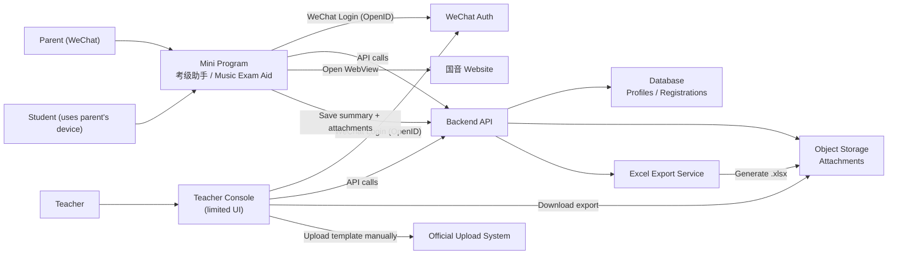

```mermaid
flowchart LR
    %% --- NODES ---
    P["Parent (WeChat)"]
    MP["Mini Program<br/>考级助手 / Music Exam Aid"]
    S["Student (uses parent's device)"]
    T["Teacher"]
    TC["Teacher Console<br/>(limited UI)"]
    WA["WeChat Auth"]
    BE["Backend API"]
    DB["Database<br/>Profiles / Registrations"]
    OS["Object Storage<br/>Attachments"]
    EX["Excel Export Service"]
    OUS["Official Upload System"]
    GW["国音 Website"]

    %% --- FLOWS ---
    P --> MP
    S --> MP
    T --> TC

    MP -->|"WeChat Login (OpenID)"| WA
    TC -->|"WeChat Login (OpenID)"| WA

    MP -->|"API calls"| BE
    TC -->|"API calls"| BE

    BE --> DB
    BE --> OS

    BE --> EX
    EX -->|"Generate .xlsx"| OS
    TC -->|"Download export"| OS
    TC -->|"Upload template manually"| OUS

    MP -->|"Open WebView"| GW
    MP -->|"Save summary + attachments"| BE
```
