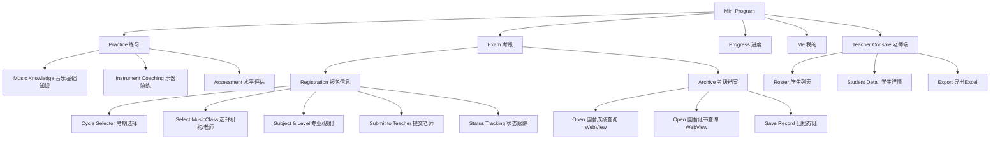
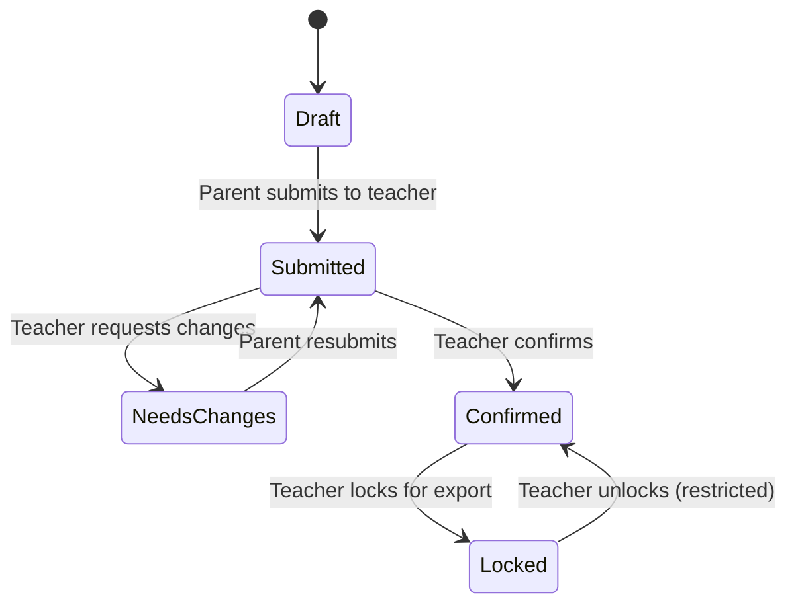
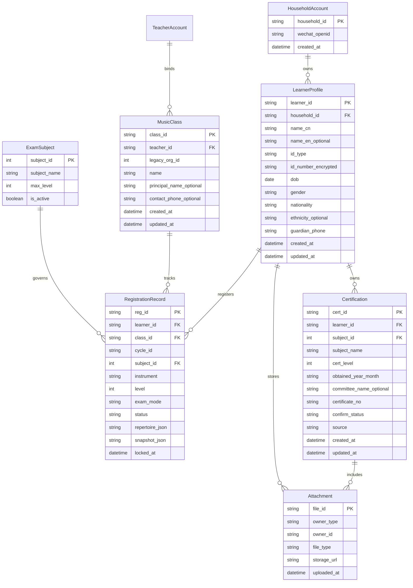

Understood. Below is an updated **high-level design (HLD v1.1)** that incorporates the latest decisions:

* “机构” maps directly to **teacher profile (MusicClass)**
* 专业/级别 rule set comes from the **报名简章 / 专业字典（含max_level）**
* Certifications are a **separate entity** (detailed now, validation integration later)
* MVP remains: profile + registration + teacher review/lock + Excel export + 国音档案归档（辅助）

---

# High-Level Design v1.1 (MVP)

## 1) Product modules

### A. Practice 练习

1. **音乐基础知识**
2. **乐器陪练**
3. **水平评估**

> Practice is a separate module from registration. It writes to learner progress, not to registration export.

### B. Exam 考级

1. **报名信息（Registration）**
2. **考级档案（Archive）**

   * 国音成绩查询（WebView）
   * 国音证书查询（WebView）
   * 保存到档案（ExamRecord / Certification attachments）

### C. Teacher Console 老师端（limited）

* Roster (by 机构/MusicClass, cycle, status)
* Student detail tabs:

  * Profile（学生档案）
  * Registration（报名记录）
  * Archive（考级档案 / 证书）

### D. Export 导出

* Excel export from **Locked** RegistrationRecords only
* Uses **template v2.1 mapping**

---

## 2) Core data objects (HLD)

### HouseholdAccount（家长账号）

* WeChat identity container
* Owns multiple LearnerProfiles

### LearnerProfile（学生档案）

* Identity: name, gender, DOB, id_type/id_no, nationality/ethnicity, guardian phone
* Attachments: `portrait_photo(彩照)`, `id_front(证照正面)`

### MusicClass（机构/老师档案）

* Represents “机构” in RegistrationRecord
* Has `legacy_org_id` for Excel export

### RegistrationRecord（报考专业记录）

* One row = one subject application in a cycle
* Key: learner_id + cycle_id + subject/instrument
* Validated against ExamSubject(max_level) rules
* Status machine: Draft → Submitted → NeedsChanges → Confirmed → Locked
* Lock-time: write `snapshot_json` for stable export

### ExamSubject（专业字典）

* subject_name + max_level (from 专业列表/简章)
* Used for validation and dropdown

### Certification（证书，独立实体）

* subject + level + obtained_month + committee + certificate_no + attachments
* Later: can power prerequisite warnings (10/11级需音基3等)

### ExamRecord（国音档案记录，结构化归档）

* Optional, used to store query result summary + attachments

---

## 3) High-level flows

### 3.1 Parent flow (registration)

1. Create/maintain LearnerProfile + attachments
2. Create RegistrationRecord(s) for cycle:

   * Choose “机构(MusicClass)” (or assigned via join)
   * Choose 专业/级别 (validated by max_level)
3. Submit to teacher
4. Receive change request → edit → resubmit
5. Teacher locks → becomes exportable

### 3.2 Teacher flow

1. Filter roster by cycle/status/专业/级别
2. Open student detail:

   * Fix formatting errors
   * Confirm / request changes
   * Lock for export
3. Export Excel template

### 3.3 Archive flow (国音)

1. Open 国音 query page in WebView
2. User performs query and sees result
3. Save summary + upload attachment(s) into 考级档案
4. Teacher can view/confirm archive records (lightweight)

---

## 4) Rules that are “HLD-level” (not deep spec)

### 专业/级别

* Each subject has a max level:

  * 音基 1–6
  * Some instruments 1–9 / 1–10 / 1–11
* UI enforces allowed levels via dropdown filtered by subject.

### Export

* Only `Locked` records can be exported
* Export uses snapshot to avoid downstream profile edits breaking the batch

---

# Updated diagrams (Mermaid, consistent with your conventions)

## A) IA map (v1.1)

## D) Registration status state machine (unchanged)

## C) ERD (HLD subset, v1.1)

---

If you want one more refinement at HLD level, the next best addition is a **single “System Context” diagram** (Mini Program ↔ Backend ↔ Storage ↔ Export service ↔ 国音 WebView) to make architecture and responsibilities explicit.
