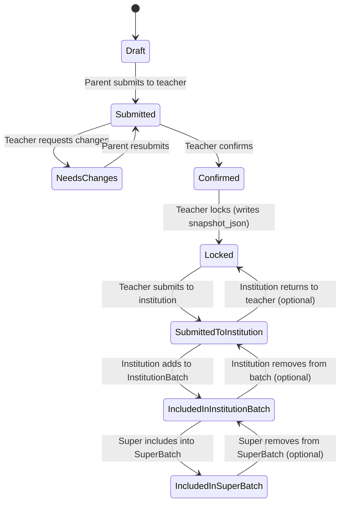

Yes. Since the tooling is failing to generate a ZIP artifact in this session, below is a **copy-paste “file pack”** for **MVP v2.2.1**: each section is a separate file. You can drop these into a folder and zip it locally (or in Cursor) as `Music_Exam_Aid_MVP_Pack_v2.2.1.zip`.

---

## `README.md`

```md
# Music Exam Aid — MVP Pack v2.2.1

This pack aggregates the v2.2.1 documentation and implementation-ready specs.

## Contents
- MVP_Product_Documentation_Pack_v2.2.1.md
- Diagrams_v2.2.md (Mermaid)
- OpenAPI_v2.2.yaml
- Export_Mapping_v2.2.md
- export_mapping_spec.json
- Exporter_Test_Matrix_v2.2.md
- Screen_Specs_TA_S1_S2_v2.2.md

Notes:
- Template v2.1 is “header order stable”. Exporter writes by reading headers left→right, mapping by header name.
- Export unit is SuperBatch only.
```

---

## `MVP_Product_Documentation_Pack_v2.2.1.md`

```md
# MVP Product Documentation Pack v2.2.1 (Complete)

## 1) Product scope statement

Product: WeChat Mini Program “考级助手 / Music Exam Aid”

MVP Objective (v2.2):
- Enable parents to create learner profiles and registrations per exam cycle, submit to teacher for review/confirm/lock.
- Enable teachers to review/confirm/lock registrations, then submit locked registrations to institution admin.
- Enable institution admin to aggregate registrations into InstitutionBatch and submit to the Super Institution.
- Enable Super Institution to ingest InstitutionBatches, build a SuperBatch, resolve conflicts/dedup, and export exactly once (Template v2.1).
- Provide “考级档案 / Archive” and “证书 / Certification” vault for storage and later verification (manual capture, assisted WebView for 国音).

Non-goals (MVP):
- WeChat Pay
- Automated scraping/auto-sync from 国音
- Full teaching LMS
- End-to-end official system submission (we export XLSX; upload is manual)

---

## 2) Personas and responsibilities

### Parent (WeChat account owner)
- Create/manage learner profiles
- Enroll learner to an institution (MusicClass)
- Create registration record per cycle
- Submit registration to teacher
- Maintain archive + certification records (manual save)

### Student (practice actor, uses parent’s phone)
- Uses practice modes:
  - 音乐基础知识（Quiz + 错题本）
  - 乐器陪练（Record → AI feedback → drills → re-record）
  - 水平评估（Mock assessment → readiness + gaps）

### Teacher (TeacherProfile; may have Admin role)
- View roster of learners in institution scope
- Review/edit/confirm/lock registrations
- Submit locked registrations to institution admin
- Institution Admin role: build InstitutionBatch, preflight, submit to Super Institution

### Super Institution Operator
- Ingest InstitutionBatches
- Build SuperBatch (dedup + conflict resolution)
- Export once (Template v2.1)

---

## 3) Information architecture

### Tabs (Parent UI)
- 练习 Practice
- 考级 Exam (Registration + Archive + Certification)
- 进度 Progress
- 我的 Me

### Teacher console
- Roster queue + student detail + registration review actions
- Institution batch pages (Admin)

### Super console
- Incoming InstitutionBatches
- SuperBatch builder (dedup/conflicts)
- Export once

---

## 4) Key workflows and rules

### 4.1 Registration workflow (core gate discipline)
- Parent edits Draft/NeedsChanges only.
- Teacher confirms and locks.
- Lock writes snapshot_json (export uses snapshot only).
- 彩照 is treated as Attachment (portrait_photo), required at Lock.

### 4.2 Handoff & aggregation (new in v2.2)
- Teacher submits locked regs to institution admin.
- Institution admin aggregates into InstitutionBatch.
- Institution submits InstitutionBatch to Super.
- Super builds SuperBatch and exports once.

### 4.3 Dedup/Conflict rules (SuperBatch)
Uniqueness key:
- learner_id + cycle_id + subject_id

Handling:
- Same key, same level: keep newest locked_at (auto); exclude older
- Same key, different level: manual conflict resolution
- Cross-institution collision: manual resolution

---

## 5) Status model

### RegistrationRecord.workflow_status
- Draft → Submitted → NeedsChanges → Confirmed → Locked

### RegistrationRecord.handoff_status
- None → SubmittedToInstitution → IncludedInInstitutionBatch → IncludedInSuperBatch

### InstitutionBatch.inst_batch_status
- Draft → SubmittedToSuper → Returned (optional) / Accepted (optional)

### SuperBatch.super_batch_status
- Draft → Exported → Uploaded (optional)

---

## 6) MVP screens (inventory + notes)

### Parent screens
- P1 Learner list (empty state → create)
- P2 Learner create/edit (sensitive fields + attachments)
- P3 Enrollment: select institution (MusicClass) + consent
- R1 Registration list (by cycle/status)
- R2 Registration create/edit (subject/level/rules, repertoire, exam_mode)
- R3 Submit to teacher + status timeline
- A1 Archive: open 国音 WebView + manual save
- C1 Certification list + add/edit (lightweight)

### Teacher screens
- T0 Select TeacherProfile (if multiple institutions/roles)
- T1 Roster list (filters: cycle/status/subject/level, only_issues)
- T2 Student detail:
  - Profile tab (limited correction)
  - Registration tab (request changes / confirm / lock / unlock / submit-to-institution)
  - Archive/Certification tab (view only; optional edits)
- TA1 InstitutionBatches list (Admin)
- TA2 InstitutionBatch detail (add/remove items, preflight, submit-to-super)

### Super screens
- S1 Incoming InstitutionBatches (by cycle)
- S2 SuperBatch builder (ingest, dedup, conflicts)
- S3 Export once (Template v2.1; header-driven mapping)

---

## 7) Export (Template v2.1)

Export rules:
- Export is SuperBatch-only.
- Export uses snapshot_json only (captured at Lock-time).
- “Header order stable”: exporter reads header row left→right and maps by header text.
- IDs / phone numbers must be written as text to avoid scientific notation.
- DOB normalized to YYYY-MM-DD (text).

---

## 8) API artifacts
- OpenAPI_v2.2.yaml (skeleton) included
- Export mapping dictionary + test matrix included

---

## 9) Implementation sequencing (recommended)
1) DB migrations (ERD v2.2 entities + dictionaries ingestion)
2) Auth + Parent CRUD (Learner/Enrollment/Registration)
3) Teacher review + lock + submit-to-institution
4) InstitutionBatch (TA1/TA2)
5) Super intake (S1) + SuperBatch builder (S2)
6) Export once (S3) + ExportLog
7) Archive/Certification (stubs or partial)
```

---

## `Diagrams_v2.2.md`

````md
# Diagrams (Mermaid) — MVP v2.2

## IA map
```mermaid
flowchart TB
  A["Mini Program"] --> P["Parent UI"]
  A --> TC["Teacher Console"]
  A --> SIC["Super Institution Console"]

  P --> P_Practice["Practice 练习"]
  P --> P_Exam["Exam 考级"]
  P_Exam --> P_Reg["Registration 报名信息"]
  P_Exam --> P_Arc["Archive 考级档案"]
  P_Exam --> P_Cert["Certification 证书管理"]

  TC --> T0["T0 Select TeacherProfile"]
  TC --> T1["T1 Roster (Registrations)"]
  TC --> T2["T2 Student Detail"]
  TC --> TA1["TA1 Institution Batches (Admin)"]
  TC --> TA2["TA2 Batch Detail"]

  SIC --> S1["S1 Incoming InstitutionBatches"]
  SIC --> S2["S2 SuperBatch Builder"]
  SIC --> S3["S3 Export Once"]
````

## End-to-end journey

```mermaid
sequenceDiagram
  autonumber
  participant P as Parent
  participant MP as Mini Program
  participant BE as Backend
  participant T as TeacherProfile
  participant IA as Institution Admin
  participant SI as Super Operator
  participant EX as Exporter
  participant OS as Object Storage

  P->>MP: Create/Select LearnerProfile
  MP->>BE: Save LearnerProfile
  P->>MP: Select Institution + Enrollment
  MP->>BE: Create InstitutionEnrollment (Granted)

  P->>MP: Create RegistrationRecord (Draft)
  MP->>BE: Save Draft
  P->>MP: Submit to Teacher
  MP->>BE: workflow_status=Submitted

  T->>BE: Review/Confirm/Lock (writes snapshot_json)
  T->>BE: Submit to Institution (handoff_status=SubmittedToInstitution)

  IA->>BE: Create InstitutionBatch + add items
  IA->>BE: Submit InstitutionBatch to Super

  SI->>BE: Create SuperBatch + ingest institution batch
  SI->>BE: Dedup + resolve conflicts
  SI->>BE: Export once
  BE->>EX: Generate XLSX from template-order headers + snapshot_json
  EX->>OS: Store XLSX + return link
```

## Registration + handoff state machine (v2.2)



````

---

## `OpenAPI_v2.2.yaml`
> This is a **skeleton**: it is structurally correct and scaffold-ready. You can extend schemas/endpoints as you implement.

```yaml
openapi: 3.0.3
info:
  title: Music Exam Aid - MVP API
  version: "2.2.0"
  description: >
    MVP v2.2 API for WeChat Mini Program (Parent), Teacher Console, and Super Institution Console.
servers:
  - url: https://api.example.com

tags:
  - name: Dictionaries
  - name: Institutions
  - name: Learners
  - name: Enrollments
  - name: Registrations
  - name: Teacher
  - name: InstitutionBatches
  - name: Super
  - name: Attachments

security:
  - bearerAuth: []

paths:
  /dictionaries/subjects:
    get:
      tags: [Dictionaries]
      summary: List exam subjects
      responses:
        "200":
          description: OK
          content:
            application/json:
              schema: { $ref: "#/components/schemas/SubjectsResponse" }

  /dictionaries/cycles:
    get:
      tags: [Dictionaries]
      summary: List exam cycles
      responses:
        "200":
          description: OK
          content:
            application/json:
              schema: { $ref: "#/components/schemas/CyclesResponse" }

  /institutions:
    get:
      tags: [Institutions]
      summary: List institutions (MusicClass)
      parameters:
        - in: query
          name: q
          schema: { type: string }
      responses:
        "200":
          description: OK
          content:
            application/json:
              schema: { $ref: "#/components/schemas/InstitutionsResponse" }

  /institutions/{class_id}/teachers:
    get:
      tags: [Institutions]
      summary: List teachers under an institution
      parameters:
        - $ref: "#/components/parameters/ClassId"
      responses:
        "200":
          description: OK
          content:
            application/json:
              schema: { $ref: "#/components/schemas/InstitutionTeachersResponse" }

  /learners:
    get:
      tags: [Learners]
      summary: List learners (Parent scope)
      responses:
        "200":
          description: OK
          content:
            application/json:
              schema: { $ref: "#/components/schemas/LearnersResponse" }
    post:
      tags: [Learners]
      summary: Create learner profile (Parent)
      requestBody:
        required: true
        content:
          application/json:
            schema: { $ref: "#/components/schemas/LearnerUpsertRequest" }
      responses:
        "200":
          description: Created
          content:
            application/json:
              schema: { $ref: "#/components/schemas/LearnerIdResponse" }

  /learners/{learner_id}:
    get:
      tags: [Learners]
      summary: Get learner detail
      parameters:
        - $ref: "#/components/parameters/LearnerId"
      responses:
        "200":
          description: OK
          content:
            application/json:
              schema: { $ref: "#/components/schemas/LearnerDetailResponse" }
    put:
      tags: [Learners]
      summary: Update learner profile (Parent)
      parameters:
        - $ref: "#/components/parameters/LearnerId"
      requestBody:
        required: true
        content:
          application/json:
            schema: { $ref: "#/components/schemas/LearnerUpsertRequest" }
      responses:
        "200":
          description: Updated
          content:
            application/json:
              schema: { $ref: "#/components/schemas/LearnerIdResponse" }

  /enrollments:
    post:
      tags: [Enrollments]
      summary: Create enrollment (Parent)
      requestBody:
        required: true
        content:
          application/json:
            schema: { $ref: "#/components/schemas/EnrollmentCreateRequest" }
      responses:
        "200":
          description: Created
          content:
            application/json:
              schema: { $ref: "#/components/schemas/EnrollmentIdResponse" }

  /registrations:
    post:
      tags: [Registrations]
      summary: Create registration (Parent)
      requestBody:
        required: true
        content:
          application/json:
            schema: { $ref: "#/components/schemas/RegistrationCreateRequest" }
      responses:
        "200":
          description: Created
          content:
            application/json:
              schema: { $ref: "#/components/schemas/RegistrationSummaryResponse" }

  /registrations/{reg_id}/submit:
    post:
      tags: [Registrations]
      summary: Parent submits to teacher
      parameters:
        - $ref: "#/components/parameters/RegId"
      responses:
        "200":
          description: Submitted
          content:
            application/json:
              schema: { $ref: "#/components/schemas/RegistrationSummaryResponse" }

  /teacher/registrations/{reg_id}/request-changes:
    post:
      tags: [Teacher]
      summary: Teacher requests changes
      parameters:
        - $ref: "#/components/parameters/RegId"
      requestBody:
        required: true
        content:
          application/json:
            schema: { $ref: "#/components/schemas/TeacherRequestChangesRequest" }
      responses:
        "200":
          description: Updated
          content:
            application/json:
              schema: { $ref: "#/components/schemas/RegistrationSummaryResponse" }

  /teacher/registrations/{reg_id}/confirm:
    post:
      tags: [Teacher]
      summary: Teacher confirms
      parameters:
        - $ref: "#/components/parameters/RegId"
      responses:
        "200":
          description: Updated
          content:
            application/json:
              schema: { $ref: "#/components/schemas/RegistrationSummaryResponse" }

  /teacher/registrations/{reg_id}/lock:
    post:
      tags: [Teacher]
      summary: Teacher locks (writes snapshot_json)
      parameters:
        - $ref: "#/components/parameters/RegId"
      responses:
        "200":
          description: Locked
          content:
            application/json:
              schema: { $ref: "#/components/schemas/RegistrationSummaryResponse" }

  /teacher/registrations/{reg_id}/submit-to-institution:
    post:
      tags: [Teacher]
      summary: Teacher submits locked reg to institution admin
      parameters:
        - $ref: "#/components/parameters/RegId"
      responses:
        "200":
          description: SubmittedToInstitution
          content:
            application/json:
              schema: { $ref: "#/components/schemas/RegistrationSummaryResponse" }

  /institution-batches:
    post:
      tags: [InstitutionBatches]
      summary: Create InstitutionBatch (admin)
      requestBody:
        required: true
        content:
          application/json:
            schema: { $ref: "#/components/schemas/InstitutionBatchCreateRequest" }
      responses:
        "200":
          description: Created
          content:
            application/json:
              schema: { $ref: "#/components/schemas/InstitutionBatchResponse" }

  /institution-batches/{inst_batch_id}/submit-to-super:
    post:
      tags: [InstitutionBatches]
      summary: Submit InstitutionBatch to Super
      parameters:
        - $ref: "#/components/parameters/InstBatchId"
      responses:
        "200":
          description: Submitted
          content:
            application/json:
              schema: { $ref: "#/components/schemas/InstitutionBatchResponse" }

  /super/super-batches:
    post:
      tags: [Super]
      summary: Create SuperBatch
      requestBody:
        required: true
        content:
          application/json:
            schema: { $ref: "#/components/schemas/SuperBatchCreateRequest" }
      responses:
        "200":
          description: Created
          content:
            application/json:
              schema: { $ref: "#/components/schemas/SuperBatchResponse" }

  /super/super-batches/{super_batch_id}/export:
    post:
      tags: [Super]
      summary: Export XLSX from SuperBatch
      parameters:
        - $ref: "#/components/parameters/SuperBatchId"
      responses:
        "200":
          description: Export result
          content:
            application/json:
              schema: { $ref: "#/components/schemas/ExportResultResponse" }

components:
  securitySchemes:
    bearerAuth:
      type: http
      scheme: bearer
      bearerFormat: JWT

  parameters:
    ClassId:
      in: path
      name: class_id
      required: true
      schema: { type: string }
    LearnerId:
      in: path
      name: learner_id
      required: true
      schema: { type: string }
    RegId:
      in: path
      name: reg_id
      required: true
      schema: { type: string }
    InstBatchId:
      in: path
      name: inst_batch_id
      required: true
      schema: { type: string }
    SuperBatchId:
      in: path
      name: super_batch_id
      required: true
      schema: { type: string }

  schemas:
    WorkflowStatus:
      type: string
      enum: [Draft, Submitted, NeedsChanges, Confirmed, Locked]

    HandoffStatus:
      type: string
      enum: [None, SubmittedToInstitution, IncludedInInstitutionBatch, IncludedInSuperBatch]

    ConsentStatus:
      type: string
      enum: [Pending, Granted, Revoked]

    ExamMode:
      type: string
      enum: ["现场", "视频", "音基"]

    ApplicationStatus:
      type: string
      enum: ["未申请", "审核中", "审核通过"]

    InstitutionBatchStatus:
      type: string
      enum: [Draft, SubmittedToSuper, Returned, Accepted]

    SuperBatchStatus:
      type: string
      enum: [Draft, Exported, Uploaded]

    SubjectsResponse:
      type: object
      properties:
        subjects:
          type: array
          items:
            type: object
            properties:
              subject_id: { type: integer }
              subject_name: { type: string }
              max_level: { type: integer }
              is_active: { type: boolean }
          required: [subjects]
      required: [subjects]

    CyclesResponse:
      type: object
      properties:
        cycles:
          type: array
          items:
            type: object
            properties:
              cycle_id: { type: string }
              display_name: { type: string }
          required: [cycles]
      required: [cycles]

    InstitutionsResponse:
      type: object
      properties:
        institutions:
          type: array
          items:
            type: object
            properties:
              class_id: { type: string }
              legacy_org_id: { type: integer }
              name: { type: string }
          required: [institutions]
      required: [institutions]

    InstitutionTeachersResponse:
      type: object
      properties:
        teachers:
          type: array
          items:
            type: object
            properties:
              teacher_profile_id: { type: string }
              teacher_name: { type: string }
              teacher_phone_optional: { type: string }
          required: [teachers]
      required: [teachers]

    LearnerUpsertRequest:
      type: object
      properties:
        name_cn: { type: string }
        name_en_optional: { type: string }
        gender: { type: string, enum: ["男", "女"] }
        dob: { type: string, description: "YYYY-MM-DD" }
        nationality: { type: string }
        ethnicity_optional: { type: string }
        id_type: { type: string }
        id_number_plaintext:
          type: string
          description: "Client submits; server encrypts. Never returned as plaintext."
        guardian_phone: { type: string }
        mailing_address_optional: { type: string }
        recipient_name_optional: { type: string }
        recipient_phone_optional: { type: string }
      required: [name_cn, gender, dob, nationality, id_type, id_number_plaintext, guardian_phone]

    LearnerIdResponse:
      type: object
      properties:
        learner_id: { type: string }
      required: [learner_id]

    LearnersResponse:
      type: object
      properties:
        learners:
          type: array
          items:
            type: object
            properties:
              learner_id: { type: string }
              name_cn: { type: string }
              gender: { type: string, enum: ["男", "女"] }
              dob: { type: string }
              id_type: { type: string }
              id_last4: { type: string }
          required: [learners]
      required: [learners]

    LearnerDetailResponse:
      type: object
      properties:
        learner:
          type: object
          properties:
            learner_id: { type: string }
            name_cn: { type: string }
            name_en_optional: { type: string }
            gender: { type: string, enum: ["男", "女"] }
            dob: { type: string }
            nationality: { type: string }
            ethnicity_optional: { type: string }
            id_type: { type: string }
            id_last4: { type: string }
            guardian_phone: { type: string }
            mailing_address_optional: { type: string }
            recipient_name_optional: { type: string }
            recipient_phone_optional: { type: string }
      required: [learner]

    EnrollmentCreateRequest:
      type: object
      properties:
        learner_id: { type: string }
        class_id: { type: string }
        consent_status: { $ref: "#/components/schemas/ConsentStatus" }
      required: [learner_id, class_id, consent_status]

    EnrollmentIdResponse:
      type: object
      properties:
        enrollment_id: { type: string }
      required: [enrollment_id]

    RegistrationCreateRequest:
      type: object
      properties:
        learner_id: { type: string }
        class_id: { type: string }
        cycle_id: { type: string }
        subject_id: { type: integer }
        level: { type: integer }
        exam_mode: { $ref: "#/components/schemas/ExamMode" }
        exam_site_id_optional: { type: string }
        repertoire:
          type: array
          items: { type: string }
          description: "Length 4 preferred."
        application_status: { $ref: "#/components/schemas/ApplicationStatus" }
        teacher_profile_id_optional: { type: string }
      required: [learner_id, class_id, cycle_id, subject_id, level, exam_mode]

    RegistrationSummaryResponse:
      type: object
      properties:
        reg_id: { type: string }
        learner_id: { type: string }
        class_id: { type: string }
        cycle_id: { type: string }
        subject_id: { type: integer }
        instrument: { type: string }
        level: { type: integer }
        workflow_status: { $ref: "#/components/schemas/WorkflowStatus" }
        handoff_status: { $ref: "#/components/schemas/HandoffStatus" }
        missing_flags:
          type: array
          items: { type: string }
      required: [reg_id, workflow_status]

    TeacherRequestChangesRequest:
      type: object
      properties:
        teacher_notes: { type: string }
        reason_codes_optional:
          type: array
          items: { type: string }
      required: [teacher_notes]

    InstitutionBatchCreateRequest:
      type: object
      properties:
        teacher_profile_id: { type: string }
        cycle_id: { type: string }
        template_version: { type: string, enum: ["v2.1"] }
      required: [teacher_profile_id, cycle_id, template_version]

    InstitutionBatchResponse:
      type: object
      properties:
        inst_batch_id: { type: string }
        class_id: { type: string }
        cycle_id: { type: string }
        template_version: { type: string }
        inst_batch_status: { $ref: "#/components/schemas/InstitutionBatchStatus" }
        item_count: { type: integer }
      required: [inst_batch_id, inst_batch_status]

    SuperBatchCreateRequest:
      type: object
      properties:
        cycle_id: { type: string }
        template_version: { type: string, enum: ["v2.1"] }
      required: [cycle_id, template_version]

    SuperBatchResponse:
      type: object
      properties:
        super_batch_id: { type: string }
        cycle_id: { type: string }
        template_version: { type: string }
        super_batch_status: { $ref: "#/components/schemas/SuperBatchStatus" }
      required: [super_batch_id, super_batch_status]

    ExportResultResponse:
      type: object
      properties:
        export_id: { type: string }
        record_count: { type: integer }
        file_url: { type: string }
      required: [export_id, record_count, file_url]
````

---

## `Export_Mapping_v2.2.md`

```md
# Task #3 — Excel Template Mapping Doc (v2.2 / Template v2.1)

## Export contract
- Export unit: SuperBatch (super_batch_id, cycle_id, template_version=v2.1)
- Rows: one row per SuperBatchItem.reg_id
- Source of truth: RegistrationRecord.snapshot_json (written at Lock)
- Column order: strict; must preserve template header order

## Strict writer rule
1) Load template v2.1 workbook
2) Read header row left→right (headers_in_order)
3) For each snapshot row, for each header, write mapped value into existing column index
4) Do not add/reorder columns
5) Keep workbook styles and data validations intact

## Header-driven mapping dictionary
See export_mapping_spec.json in this pack.
```

---

## `export_mapping_spec.json`

```json
{
  "报名机构ID": { "path": "legacy_org_id", "required": true, "formatter": "asTextInt", "default": "" },
  "报名点ID": { "path": "exam_site_id_optional", "required": false, "formatter": "asTextInt", "default": "" },

  "姓名": { "path": "name_cn", "required": true, "formatter": "asTrimmed", "default": "" },
  "拼音或英文": { "path": "name_en_optional", "required": false, "formatter": "asTrimmed", "default": "" },
  "性别": { "path": "gender", "required": true, "formatter": "asEnum", "enum": ["男", "女"], "default": "" },
  "国籍": { "path": "nationality", "required": true, "formatter": "asTrimmedOrDefault", "default": "中国" },
  "民族": { "path": "ethnicity_optional", "required": false, "formatter": "asTrimmed", "default": "" },

  "证件类型": { "path": "id_type", "required": true, "formatter": "asTrimmed", "default": "" },
  "证件号码": { "path": "id_number_plaintext", "required": true, "formatter": "asText", "default": "" },
  "联系电话": { "path": "guardian_phone", "required": true, "formatter": "asText", "default": "" },
  "出生日期": { "path": "dob", "required": true, "formatter": "asDateText_YYYY_MM_DD", "default": "" },

  "邮寄地址": { "path": "mailing_address_optional", "required": false, "formatter": "asTrimmed", "default": "" },
  "收件人": { "path": "recipient_name_optional", "required": false, "formatter": "asTrimmed", "default": "" },
  "收件电话": { "path": "recipient_phone_optional", "required": false, "formatter": "asText", "default": "" },

  "报考专业": { "path": "instrument", "required": true, "formatter": "asTrimmed", "default": "" },
  "报考级别": { "path": "level", "required": true, "formatter": "asTextInt", "default": "" },

  "考试曲目1": { "path": "repertoire.0", "required": false, "formatter": "asTrimmed", "default": "" },
  "考试曲目2": { "path": "repertoire.1", "required": false, "formatter": "asTrimmed", "default": "" },
  "考试曲目3": { "path": "repertoire.2", "required": false, "formatter": "asTrimmed", "default": "" },
  "考试曲目4": { "path": "repertoire.3", "required": false, "formatter": "asTrimmed", "default": "" },

  "集体老师姓名": { "path": "teacher_name_optional", "required": false, "formatter": "asTrimmed", "default": "" },
  "集体老师联系电话": { "path": "teacher_phone_optional", "required": false, "formatter": "asText", "default": "" },

  "考试方式": { "path": "exam_mode", "required": true, "formatter": "asEnum", "enum": ["现场", "视频", "音基"], "default": "" },
  "报考状态": { "path": "application_status", "required": true, "formatter": "asEnumOrDefault", "enum": ["未申请", "审核中", "审核通过"], "default": "审核通过" },

  "考期": { "path": "cycle_id", "required": false, "formatter": "asTrimmed", "default": "" }
}
```

---

## `Exporter_Test_Matrix_v2.2.md`

```md
# Exporter Test Matrix (Template v2.1, Strict Mode)

## 1) Template/header integrity
- T-01 Template loads and sheet resolves → ERR_TEMPLATE_SHEET_NOT_FOUND
- T-02 Duplicate headers → ERR_TEMPLATE_DUPLICATE_HEADER
- T-03 Missing required header (e.g., 姓名) → ERR_TEMPLATE_MISSING_REQUIRED_HEADER
- T-04 Optional header missing (考期) → OK
- T-05 Unknown headers exist (备注) → OK (leave blank)
- T-06 Header order changes but names stable → OK (write by header)

## 2) Snapshot presence & eligibility
- S-01 snapshot_json missing → ERR_SNAPSHOT_MISSING
- S-02 reg not Locked → ERR_REG_NOT_LOCKED
- S-03 empty SuperBatch → allow export with 0 rows (policy-dependent)

## 3) Field strict validation
- V-01 required field blank → ERR_REQUIRED_FIELD_EMPTY
- V-02 enum invalid (性别/考试方式) → ERR_ENUM_INVALID
- V-03 DOB unparseable → ERR_DATE_PARSE
- V-04 application_status blank → default 审核通过
- V-05 nationality blank → default 中国

## 4) Excel formatting/coercion
- F-01 ID not scientific (write as text)
- F-02 phone leading zeros preserved
- F-03 date normalized to YYYY-MM-DD text
- F-04 repertoire shorter than 4 → fill blanks
- F-05 trimming whitespace

## 5) Teacher contact precedence (snapshot builder)
- P-01 assigned teacher_profile_id_optional → use TeacherProfile
- P-02 else fallback to MusicClass default contact
- P-03 else blank

## 6) SuperBatch dedup/conflict (builder)
- D-01 same key same level → keep newest locked_at
- D-02 same key different level → manual resolution
- D-03 cross-institution collision → manual resolution
- D-04 same learner different subject → allowed
- D-05 different cycle → allowed

## 7) E2E
- E2E-01 golden file compare (structure + key cells)
- E2E-02 ExportLog written on success
- E2E-03 failure does not write ExportLog
```

---

## `Screen_Specs_TA_S1_S2_v2.2.md`

```md
# Screen Specs — TA1/TA2 + S1/S2/S3 (MVP v2.2)

## TA1 Institution Batch List
Role gate:
- TeacherProfile.role == Admin OR TeacherProfile.can_export_optional == true

Filters:
- cycle_id (required)
- inst_batch_status

Actions:
- Create batch
- Open batch
- Submit to super (when ready)

## TA2 Institution Batch Detail
Eligibility:
- workflow_status == Locked
- handoff_status == SubmittedToInstitution
- snapshot_json exists (mandatory)

Actions:
- Add items: sets handoff_status = IncludedInInstitutionBatch
- Remove items: sets handoff_status = SubmittedToInstitution (or stays IncludedInInstitutionBatch per policy)
- Preflight: run validations without generating XLSX
- Submit to super: inst_batch_status = SubmittedToSuper

## S1 Incoming InstitutionBatches
Filters:
- cycle_id required
- status default SubmittedToSuper

Actions:
- View batch
- Add to an existing SuperBatch
- Mark handled (optional)

## S2 SuperBatch Builder
Create:
- cycle_id + template_version

Ingest:
- Add InstitutionBatches; include items only if Locked + snapshot exists

Dedup:
- key = learner_id|cycle_id|subject_id
- auto-resolve if same level (keep newest locked_at)
- manual resolve if level mismatch / cross-institution collision

Preflight + Export:
- Must be “no conflicts pending” before export is enabled

## S3 Export Once
Actions:
- Export SuperBatch -> generate XLSX using template-order header-driven mapping
- Write ExportLog on success
```

---

If you want, in the next step I will format this same pack into **(a)** a single “master” `SPEC_v2.2.1.md` and **(b)** a `docs/` structure (e.g., `docs/01_overview.md`, `docs/02_flows.md`, `docs/03_export.md`, `api/openapi.yaml`) so your Cursor repo has a clean layout.
