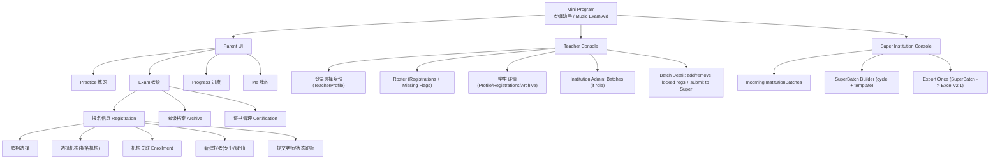
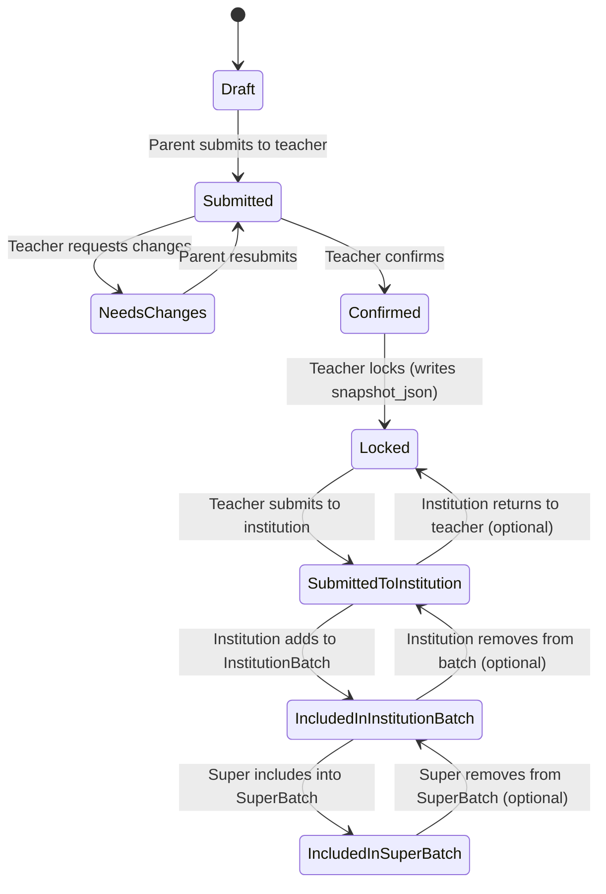
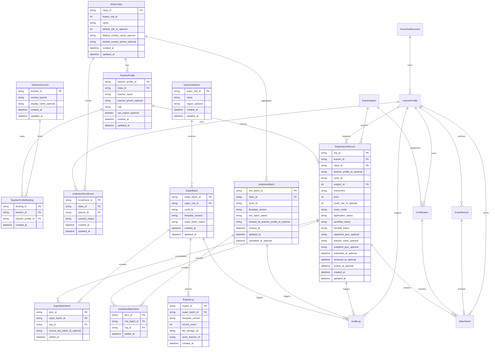

Understood. Below is the **fully updated design pack (Version v2.2)** that incorporates the **Super Institution aggregation + “export once”** operating model. This supersedes prior v2.1 artifacts and becomes the new single source of truth. After this, we can proceed to **Task #3 (Excel mapping)** on top of the new batching/export flow.

---

# MVP Product Documentation Pack v2.2

## 1) Product scope statement (updated)

**Product:** WeChat Mini Program “考级助手 / Music Exam Aid”

**MVP Objective (v2.2):**

* Parents create/manage learner profiles, link learners to an **institution (MusicClass)**, and create registrations per exam cycle.
* Teachers (via **TeacherProfile**) review → confirm → lock registrations.
* Teachers submit locked registrations to **Institution Admin** for aggregation.
* Institution Admin submits an **InstitutionBatch** to **Super Institution**.
* Super Institution builds a **SuperBatch** and performs **one consolidated export** (Excel template v2.1) for official upload.

**Non-goals (MVP):**

* WeChat Pay, automated scraping/auto-sync from 国音, full LMS, end-to-end official system submission.

---

## 2) Personas & responsibilities (updated)

### Parent (WeChat account owner)

* Create/manage learner profiles + attachments (彩照等)
* Link learner to institution (enrollment/consent)
* Create/edit registration drafts; submit to teacher
* Maintain archive/certifications

### Student (practice actor)

* Practice features (not blocking registration MVP)

### Teacher (institution staff)

* **TeacherAccount**: WeChat identity
* **TeacherProfile**: teacher role under an institution
  Responsibilities:
* View enrolled learners under institution
* Review/confirm/lock registrations
* Submit locked registrations to institution admin

### Institution Admin (role on TeacherProfile)

* Aggregate locked registrations into **InstitutionBatch**
* Validate completeness, manage returns/rework
* Submit InstitutionBatch to Super Institution

### Super Institution Operator

* Receive institution batches
* Create/manage **SuperBatch**
* Export **once** for official upload
* Maintain export logs

---

# 3) Updated Information Architecture (IA v2.2)

---

# 4) Updated status model

## 4.1 Registration workflow status (unchanged core)

* `workflow_status`: Draft → Submitted → NeedsChanges → Confirmed → Locked

## 4.2 New handoff status (v2.2)

* `handoff_status`: None → SubmittedToInstitution → IncludedInInstitutionBatch → IncludedInSuperBatch

## 4.3 InstitutionBatch status

* `inst_batch_status`: Draft → SubmittedToSuper → Accepted (optional) / Returned (optional)

## 4.4 SuperBatch status

* `super_batch_status`: Draft → Exported → Uploaded(optional)

### Registration state machine (updated)

---

# 5) Updated ERD (v2.2 canonical)

---

# 6) Screen inventory updates (delta from prior)

## 6.1 Teacher Console updates

### T2b Registration actions (per record)

* Existing: 退回修改 / 确认 / 锁定 / 解锁
* New: **提交机构** (enabled when Locked; sets `handoff_status=SubmittedToInstitution`)

### New: TA1 Institution Admin Batch List (role-gated)

* Filters: cycle, batch status
* CTA: 创建批次 (InstitutionBatch Draft)
* CTA: 打开批次

### New: TA2 Batch Detail

* Add Locked registrations (across all teachers in institution)
* Show completeness checks
* Submit to Super Institution (inst_batch_status=SubmittedToSuper)
* Optional: return individual registrations (handoff revert) or mark batch Returned

## 6.2 Super Institution Console (new module)

### S1 Incoming InstitutionBatches

* List by institution + cycle + status SubmittedToSuper
* Open batch, inspect counts/issues

### S2 SuperBatch Builder

* Create SuperBatch (cycle + template v2.1)
* Add batches or selected items
* Deduplicate + conflict resolution view (see below)

### S3 Export Once

* Export from SuperBatch only
* Write ExportLog with super_batch_id, record_count, file url

---

# 7) Updated permissions (v2.2)

* **TeacherProfile (Reviewer):**

  * Confirm/Lock registrations for their institution scope
  * Submit locked records to institution admin
  * No export rights

* **TeacherProfile (Institution Admin):**

  * Manage InstitutionBatch
  * Submit InstitutionBatch to Super
  * No “final export once” unless you decide to centralize export at super only

* **Super Institution Operator:**

  * Manage SuperBatch
  * Export once
  * Maintain ExportLog

---

# 8) New operational rules (important for Task 3)

## 8.1 Export source of truth

* Export uses **RegistrationRecord.snapshot_json** written at **Lock** time.
* Batches only aggregate references (`reg_id`), not mutable field data.

## 8.2 Gate rules remain

* **彩照 required at Lock** (unchanged)
* Therefore any record in SuperBatch is inherently lock-quality.

## 8.3 Deduplication rule (must define)

At SuperBatch build time, you must decide uniqueness keys, typically:

* `learner_id + cycle_id + subject_id` must be unique within a SuperBatch
  If conflicts exist:
* pick latest locked_at
* or require manual resolution

We will formalize this in Task #3.

---

# 9) Task #2 Field Dictionary additions (v2.2 delta)

New entities/enums added:

* `SuperInstitution`
* `InstitutionBatch`, `InstitutionBatchItem`
* `SuperBatch`, `SuperBatchItem`
* `RegistrationRecord.handoff_status`
* `InstitutionBatch.inst_batch_status`
* `SuperBatch.super_batch_status`
* `ExportLog.super_batch_id`

If you want, I can provide the full field tables for these new entities in the same “dictionary” format, but the ERD above is now authoritative for structure.

---

# Ready for Task #3

With v2.2 in place, **Task #3 (Excel template mapping)** becomes a mapping from:

**SuperBatchItem.reg_id → RegistrationRecord.snapshot_json → Excel v2.1 rows**

Next, I will produce:

1. Column-by-column mapping (Excel v2.1)
2. Formatting rules (dates, text coercion, ID as text)
3. Merge/dedup rules for SuperBatch
4. File naming + ExportLog fields + error handling

If you paste/upload the exact v2.1 Excel template (or confirm the column header list is stable from your earlier template), I will lock the mapping to the exact column names.
