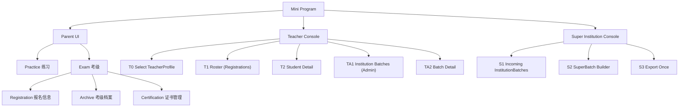
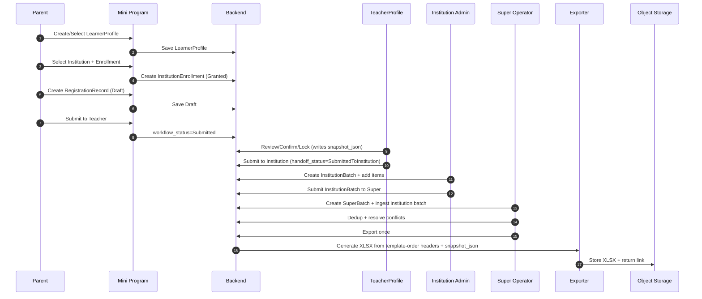
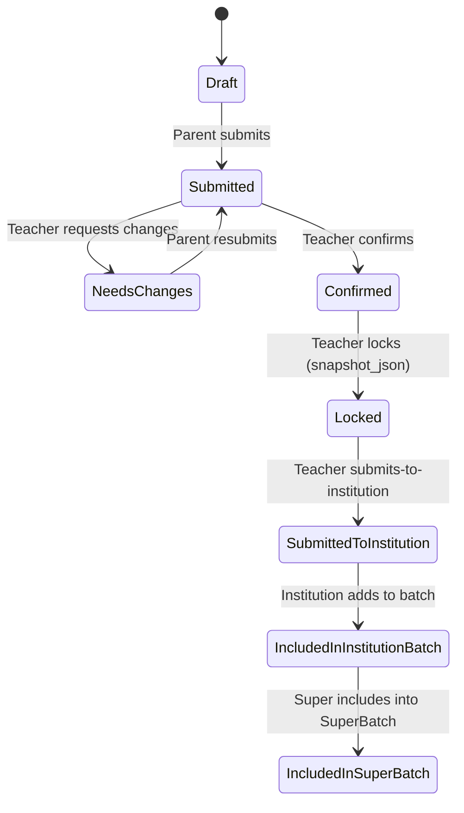

# 04 Diagrams (Mermaid) — MVP v2.2.1

## IA map

```mermaid
flowchart TB
  A["Mini Program"] --> P["Parent UI"]
  A --> TC["Teacher Console"]
  A --> SIC["Super Institution Console"]

  P --> P_Practice["Practice 练习"]
  P --> P_Exam["Exam 考级"]
  P_Exam --> P_Reg["Registration 报名信息"]
  P_Exam --> P_Arc["Archive 考级档案"]
  P_Exam --> P_Cert["Certification 证书管理"]

  TC --> T0["T0 Select TeacherProfile"]
  TC --> T1["T1 Roster (Registrations)"]
  TC --> T2["T2 Student Detail"]
  TC --> TA1["TA1 Institution Batches (Admin)"]
  TC --> TA2["TA2 Batch Detail"]

  SIC --> S1["S1 Incoming InstitutionBatches"]
  SIC --> S2["S2 SuperBatch Builder"]
  SIC --> S3["S3 Export Once"]
```

## End-to-end journey

```mermaid
sequenceDiagram
  autonumber
  participant P as Parent
  participant MP as Mini Program
  participant BE as Backend
  participant T as TeacherProfile
  participant IA as Institution Admin
  participant SI as Super Operator
  participant EX as Exporter
  participant OS as Object Storage

  P->>MP: Create/Select LearnerProfile
  MP->>BE: Save LearnerProfile
  P->>MP: Select Institution + Enrollment
  MP->>BE: Create InstitutionEnrollment (Granted)

  P->>MP: Create RegistrationRecord (Draft)
  MP->>BE: Save Draft
  P->>MP: Submit to Teacher
  MP->>BE: workflow_status=Submitted

  T->>BE: Review/Confirm/Lock (writes snapshot_json)
  T->>BE: Submit to Institution (handoff_status=SubmittedToInstitution)

  IA->>BE: Create InstitutionBatch + add items
  IA->>BE: Submit InstitutionBatch to Super

  SI->>BE: Create SuperBatch + ingest institution batch
  SI->>BE: Dedup + resolve conflicts
  SI->>BE: Export once
  BE->>EX: Generate XLSX from template-order headers + snapshot_json
  EX->>OS: Store XLSX + return link
```

## State machine

```mermaid
stateDiagram-v2
  [*] --> Draft
  Draft --> Submitted: Parent submits
  Submitted --> NeedsChanges: Teacher requests changes
  NeedsChanges --> Submitted: Parent resubmits
  Submitted --> Confirmed: Teacher confirms
  Confirmed --> Locked: Teacher locks (snapshot_json)

  Locked --> SubmittedToInstitution: Teacher submits-to-institution
  SubmittedToInstitution --> IncludedInInstitutionBatch: Institution adds to batch
  IncludedInInstitutionBatch --> IncludedInSuperBatch: Super includes into SuperBatch
```
