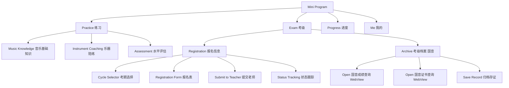
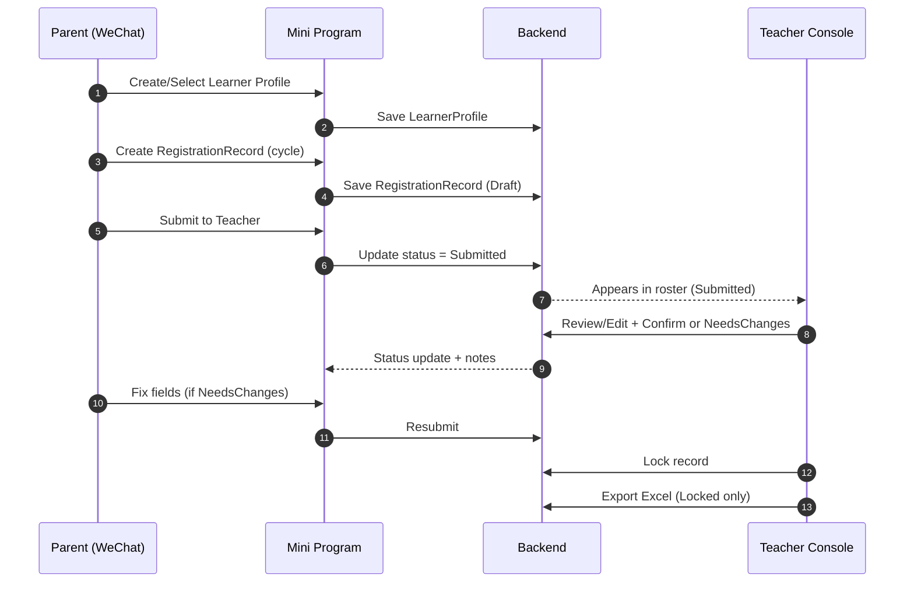
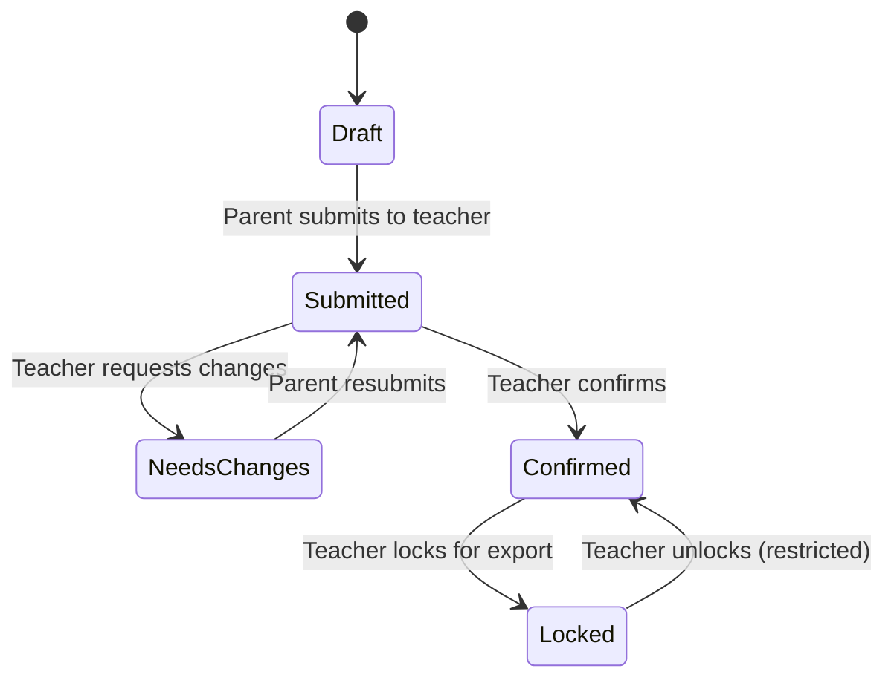

# MusicExamAid
WeChat Mini Program “考级助手 / Music Exam Aid”
### About project

Provide an overview of the project’s goals and context

MVP **Product Documentation Pack 1.0**

**1) Product scope statement**

Product: WeChat Mini Program “考级助手 / Music Exam Aid”

MVP Objective: Enable parents to create student profiles and exam-cycle registrations, enable teachers to review/confirm/lock, and export an upload-ready Excel template; additionally provide a “考级档案” vault where families can save 国音 exam results/certificates (assisted sync via official query pages).

Non-goals (MVP): WeChat Pay, automated scraping/auto-sync from 国音, full teaching LMS, end-to-end official system submission.

**2) Personas and responsibilities**

**Parent (WeChat account owner)**

- Create/manage child (learner) profiles
- Create registration record per exam cycle
- Submit registration to teacher
- Save exam results/certificates into “考级档案”

**Student (practice actor, uses parent’s phone)**

- Uses three exercise modes:
    - 音乐基础知识
    - 乐器陪练
    - 水平评估

**Teacher (limited console)**

- View roster of linked learners
- Review/edit/confirm/lock registrations
- Export Excel for official upload
- View “考级档案” for eligibility and accuracy checks

**3) Information architecture**

**Tabs (suggested)**

- 练习 Practice
- 考级 Exam (Registration + Archive)
- 进度 Progress
- 我的 Me

**Inside Practice**

- 音乐基础知识（Quiz + 错题本）
- 乐器陪练（Record → AI feedback → drills → re-record）
- 水平评估（Mock assessment session → readiness + gaps)

**Inside Exam**

- 报名信息（Registration records per cycle）
- 考级档案（国音 results/certificates vault)

# **Diagrams**



**E) Permission matrix (MVP)**

| **Object / Action** | **Parent** | **Student** | **Teacher** |
| --- | --- | --- | --- |
| LearnerProfile view | Yes | Yes (via parent) | Yes (linked only) |
| LearnerProfile edit | Yes | No | Limited (formatting/corrections) |
| RegistrationRecord create/edit (Draft/NeedsChanges) | Yes | No | Yes |
| RegistrationRecord submit | Yes | No | No |
| RegistrationRecord request changes | No | No | Yes |
| RegistrationRecord confirm | No | No | Yes |
| RegistrationRecord lock/unlock | No | No | Yes (unlock restricted) |
| Export Excel | No | No | Yes |
| ExamRecord add (archive) | Yes | No | Yes (if needed) |
| ExamRecord confirm | No | No | Yes |

# **MVP Feature Specs**

**1) Teacher Console (limited UI)**

Pages

1. Roster list (filter by cycle/status/instrument/level)
2. Student detail
    - Profile tab (view + limited edits)
    - Registration tab (review/edit/status actions)
    - Archive tab (exam results/certificates)
3. 
4. Export page (cycle → template → export)

Key constraints

- Teacher sees only learners with explicit enrollment consent.
- ID numbers masked by default (show last 4); reveal is logged.

**2) Exam registration (data capture + export)**

Excel export rule: export rows from Locked registrations only.

Template rule: start with 1–2 fixed templates (Board/Region), hard-mapped columns.

**3) Practice modes (exercise)**

- 音乐基础知识: quiz packs + 错题本
- 乐器陪练: record → feedback → drill → re-record
- 水平评估: “weekly checkpoint” assessment session

# **Next step: what I propose we produce next (pick in order)**

1. Screen inventory + wireframe notes (every screen, fields, CTAs, empty states)
2. Field dictionary (exact labels, types, validation, required by template)
3. Excel template mapping doc (column-by-column mapping + formatting rules)
4. Event tracking plan (activation, retention, funnel for teacher confirmation/export)

If you confirm the first instrument (e.g., piano) and the first board/template you want to support for export, I will draft items (2) and (3) in a concrete, implementation-ready way.

### Action items

- [ ]  

### Documents

[]()



```mermaid
sequenceDiagram
  autonumber
  participant P as Parent
  participant MP as Mini Program
  participant GW as 国音 Website (WebView)
  participant BE as Backend

  P->>MP: Tap 成绩查询/证书查询
  MP->>GW: Open official query page (WebView)
  P->>GW: Enter required fields, view result
  P->>MP: Tap 保存到档案 (in Mini Program)
  MP->>P: Prompt: enter cycle/date + instrument/level + result + cert no.
  P->>MP: Upload e-certificate/screenshot (optional)
  MP->>BE: Save ExamRecord + attachments
  BE-->>MP: Record stored; show in 考级档案
```

```mermaid
erDiagram
  HouseholdAccount ||--o{ LearnerProfile : owns
  HouseholdAccount ||--o{ ClassEnrollment : enrolls
  TeacherAccount ||--o{ Class : manages
  Class ||--o{ ClassEnrollment : has
  LearnerProfile ||--o{ ClassEnrollment : links
  LearnerProfile ||--o{ RegistrationRecord : registers
  LearnerProfile ||--o{ ExamRecord : archives
  RegistrationRecord ||--o{ Attachment : has
  ExamRecord ||--o{ Attachment : has
  RegistrationRecord ||--o{ AuditLog : generates
  ExamRecord ||--o{ AuditLog : generates

  HouseholdAccount {
    string household_id PK
    string wechat_openid
    string phone_optional
    datetime created_at
  }

  TeacherAccount {
    string teacher_id PK
    string wechat_openid
    string display_name
    datetime created_at
  }

  Class {
    string class_id PK
    string teacher_id FK
    string name
    string join_code
    datetime created_at
  }

  LearnerProfile {
    string learner_id PK
    string household_id FK
    string name_cn
    string name_en_optional
    string id_type
    string id_number_encrypted
    date dob
    string gender
    string instrument_default
    string guardian_phone
    string status
    datetime created_at
    datetime updated_at
  }

  RegistrationRecord {
    string reg_id PK
    string learner_id FK
    string class_id FK
    string cycle_id
    string board_name
    string instrument
    string level
    string exam_site_optional
    string repertoire_json
    string status
    string teacher_notes
    datetime submitted_at
    datetime reviewed_at
    datetime locked_at
  }

  ExamRecord {
    string examrec_id PK
    string learner_id FK
    string board_name
    string cycle_text
    string instrument
    string level
    string result
    string certificate_no_optional
    string verification_status_optional
    datetime recorded_at
  }

  Attachment {
    string file_id PK
    string owner_type
    string owner_id
    string file_type
    string storage_url
    datetime uploaded_at
  }

  AuditLog {
    string audit_id PK
    string entity_type
    string entity_id
    string actor_type
    string actor_id
    string action
    string diff_json
    datetime created_at
  }

  ClassEnrollment {
    string enrollment_id PK
    string class_id FK
    string learner_id FK
    string consent_status
    datetime created_at
  }
```


